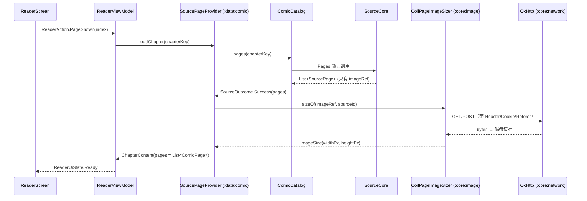
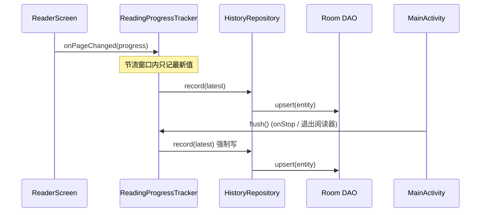
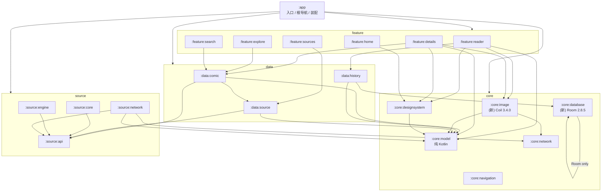
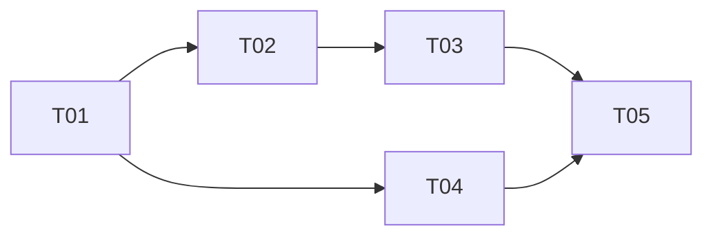

# Stage 1 收尾增量设计：S1-05 / S1-06 / S1-07

- 作者：高见远（架构师）
- 日期：2026-09-21
- 基线：`main`，AGP 9.2.1 / Gradle 9.4.1 / JDK 17 / compileSdk 37 / minSdk 26 / AGP 内置 Kotlin 2.2.10
- 上游文档：`AGENTS.md`、`docs/STATUS.md`、`docs/ARCHITECTURE.md`、`docs/IMPLEMENTATION_PLAN.md` §5（S1-05/06/07）、`docs/adr/0004-large-image-strategy.md`

本文只设计 S1-05、S1-06、S1-07 三个切片，不提前实现 Stage 2 的东西。

---

## 1. 实现方案与依赖选型

### 1.1 技术难点

| 难点 | 方案 |
| --- | --- |
| 源只给 URL，`ComicPage` 要 `widthPx/heightPx` | 图片管线先落地磁盘缓存，再从**头部**解析尺寸，不整页解码；解析失败才降级到 `BitmapFactory.inJustDecodeBounds` |
| 鉴权不同的请求不能复用缓存 | 自定义 `Keyer`：缓存键 = URL + Method + Body 摘要 + **响应相关 Header 的规范化集合** + 来源分区；`User-Agent` 等无响应影响的头**不进键**（否则缓存碎片化） |
| Header / Referer / Cookie / POST 图片 | 自建 `ComicImageFetcher` 走自己的 OkHttp，不走 Coil 默认网络栈 |
| 超长图不能交给通用库 fit 采样 | 维持 ADR-0004：Coil 只做**网络获取 + 磁盘缓存 + 常规图（封面）解码**；页面仍由自有 `RegionPageImageDecoder` 解码 |
| 解码代码在 feature 层是技术债 | 随 `:core:image` 建立整体迁移（第 4 节） |
| 进度频繁变化不能每次写库 | `:data:history` 内节流 + `flush()` 强制落盘；`:app` 在 `onStop` 调用 |
| Room + AGP 内置 Kotlin | AGP 9 自带 KGP 2.2.10，并会把 KSP 提升到 `2.2.10-2.0.2`（AGP 9.0 release notes 明确），无需退出内置 Kotlin |

### 1.2 版本选择（已联网核实，不凭记忆）

| 依赖 | 版本 | 核实依据 |
| --- | --- | --- |
| Coil 3 | **3.4.0** | `repo1` 上 `coil-compose` 最新 release 是 **3.6.3**；但 3.5.0 起用 **Kotlin 2.4.0** 编译（`coil-compose-3.5.0.pom` → `kotlin-stdlib 2.4.0`，3.6.3 → 2.4.10）。本工具链 KGP=2.2.10，**读不了 2.4 元数据**——这与仓库已有的结论一致：`quickjs-kt` 1.0.5（Kotlin 2.3.20）可用、1.0.6（2.4.10）不可用。3.4.0 → `kotlin-stdlib 2.3.10`，在已验证可读的 2.3.x 区间内，是**可用范围内的最新版** |
| Room | **2.8.5** | Google Maven `androidx/room/room-runtime` 最新稳定版（2026-09-09）；`room-runtime-2.8.5.pom` → `kotlin-stdlib 2.1.20`，元数据远低于 2.2.10，安全 |
| KSP | **2.3.10** | 文档给出的是 AGP 9 自动对齐的 `2.2.10-2.0.2`，工程师实测冒烟通过的是 **2.3.10**（`AndroidRoomLibraryConventionPlugin` 可用、schema 能导出）。以实测为准 |

> 实现注意（工程师实测）：`KspExtension` 的真实包名是 `com.google.devtools.ksp.gradle.KspExtension`；
> 顶层 `build.gradle.kts` **不要**加 `buildscript { classpath(ksp) }` —— KSP 插件进根 classpath 后会对所有子项目可见，
> AGP 的 `KgpUtils.isKspPluginApplied()` 会去加载它，而那条 classpath 上没有 KGP，直接 `NoClassDefFoundError`。
> 只在 `build-logic` 里声明即可。

需要的 Coil 产物：`coil-core`（`ImageLoader`/`ComponentRegistry`/`Fetcher`/`Keyer`/`DiskCache`）、`coil-compose`（封面渲染）、`coil-test`（`FakeImageLoaderEngine`，仅测试）。**不引入 `coil-network-okhttp`**：网络由自建 Fetcher 走 `:core:network` 的共享 OkHttp，这样连接池、Dispatcher、超时策略与全应用一致，也不必把 Header 语义塞进 Coil 的网络层。

### 1.3 Version Catalog 新增（`gradle/libs.versions.toml`）

```toml
[versions]
coil = "3.4.0"
room = "2.8.5"
# KSP is pinned by AGP 9 built-in Kotlin (KGP 2.2.10); declared in build-logic, not as a library.

[libraries]
coil-core = { module = "io.coil-kt.coil3:coil-core", version.ref = "coil" }
coil-compose = { module = "io.coil-kt.coil3:coil-compose", version.ref = "coil" }
coil-test = { module = "io.coil-kt.coil3:coil-test", version.ref = "coil" }
androidx-room-runtime = { module = "androidx.room:room-runtime", version.ref = "room" }
androidx-room-ktx = { module = "androidx.room:room-ktx", version.ref = "room" }
androidx-room-compiler = { module = "androidx.room:room-compiler", version.ref = "room" }
androidx-room-testing = { module = "androidx.room:room-testing", version.ref = "room" }
```

`build-logic/build.gradle.kts` 追加：

```kotlin
// build-logic 依赖（不要在顶层 build.gradle.kts 加 buildscript classpath，见 §1.2 注）
dependencies {
    implementation("com.android.tools.build:gradle:9.2.1")
    implementation("org.jetbrains.kotlin.plugin.compose:org.jetbrains.kotlin.plugin.compose.gradle.plugin:2.2.10")
    implementation("com.google.devtools.ksp:symbol-processing-gradle-plugin:2.3.10")
}
```

### 1.4 新增约定插件（Room 模块专用）

`build-logic/src/main/kotlin/AndroidRoomLibraryConventionPlugin.kt`，id 为 `venera.android.room.library`（在 `gradlePlugin` 块注册）：

```kotlin
import com.google.devtools.ksp.gradle.KspExtension   // 包名实测如此，不是 com.google.devtools.ksp.*

class AndroidRoomLibraryConventionPlugin : Plugin<Project> = with(target) {
    pluginManager.apply("com.android.library")
    pluginManager.apply("com.google.devtools.ksp")
    extensions.configure<LibraryExtension> { configureVeneraAndroidLibrary(compose = false) }
    extensions.configure<KspExtension> {
        arg("room.schemaLocation", "$projectDir/schemas")   // 导出目录必须入库
    }
}
```

只有 `:core:database` 用它（目前唯一需要 KSP 的模块），不污染其他约定插件。

---

## 2. 新模块结构与 `build.gradle.kts`

### 2.1 `:core:image`（Compose 已启用）

```text
core/image/build.gradle.kts
core/image/src/main/kotlin/dev/veneranative/core/image/
├── ComicImageRequest.kt            # 请求模型、HttpMethod、ComicImageBody
├── ComicImageCacheKey.kt           # 稳定缓存键（纯函数，JVM 可测）
├── ComicImageAuthProvider.kt       # 鉴权头与指纹来源（接口）
├── ComicImageKeyer.kt              # Coil Keyer
├── ComicImageFetcher.kt            # Coil Fetcher（OkHttp）
├── ComicImageLoader.kt             # ImageLoader 工厂 + CompositionLocal
├── ComicImagePipeline.kt           # sizeOf / cachedFileOf
├── CoilPageImageSizer.kt           # 实现 :core:model 的 PageImageSizer
├── ImageSizeHeaderParser.kt        # 纯 Kotlin：JPEG/PNG/WebP/GIF 头部尺寸
├── tiling/PageTiling.kt            # ← 从 :feature:reader 迁移
├── tiling/PageImageModels.kt       # ← DecodeStrategy/PageViewport/PageRegion/PageTile/PageDecodeRequest/DecodedPageImage
├── decode/PageImageDecoder.kt      # ← 迁移
├── decode/SampledPageImageDecoder.kt
├── decode/RegionPageImageDecoder.kt
├── decode/CachingPageImageDecoder.kt
├── decode/PageImageCache.kt
└── compose/ComicImage.kt           # AsyncImage 薄封装，feature 不 import Coil
core/image/src/test/kotlin/dev/veneranative/core/image/
├── ComicImageCacheKeyTest.kt
├── ImageSizeHeaderParserTest.kt
├── tiling/PageTilingTest.kt        # ← 迁移
└── decode/PageDecodeBudgetTest.kt  # ← 迁移
core/image/src/androidTest/kotlin/dev/veneranative/core/image/
└── ComicImageFetcherTest.kt        # MockWebServer：Header/Referer/Cookie/POST + 跨鉴权不复用
```

```kotlin
// core/image/build.gradle.kts
plugins { id("venera.android.compose.library") }
android { namespace = "dev.veneranative.core.image" }
dependencies {
    api(project(":core:model"))          // ComicPage/SourceId/PageImageSizer 出现在公开签名里
    implementation(project(":core:network"))
    implementation(libs.coil.core)
    implementation(libs.coil.compose)
    implementation(platform(libs.compose.bom))
    implementation(libs.compose.foundation)
    implementation(libs.compose.ui)
    implementation(libs.okhttp)          // 经 :core:network 传递即可，显式声明便于裁剪
    implementation(libs.kotlinx.coroutines.core)
    testImplementation(libs.junit4)
    testImplementation(libs.kotlinx.coroutines.test)
    testImplementation(libs.coil.test)
    androidTestImplementation(libs.okhttp.mockwebserver)
    androidTestImplementation(libs.androidx.test.ext.junit)
    androidTestImplementation(libs.androidx.test.runner)
    androidTestImplementation(libs.kotlinx.coroutines.test)
}
```

### 2.2 `:core:database`

```text
core/database/build.gradle.kts
core/database/schemas/dev/veneranative/core/database/VeneraDatabase/1.json
core/database/src/main/kotlin/dev/veneranative/core/database/
├── VeneraDatabase.kt
├── ReadingHistoryEntity.kt
├── ReadingProgressEntity.kt
├── ReadingHistoryDao.kt
├── ReadingProgressDao.kt
└── VeneraDatabaseFactory.kt        # Room.databaseBuilder(applicationContext) 单例
core/database/src/androidTest/kotlin/dev/veneranative/core/database/
├── ReadingHistoryDaoTest.kt
└── VeneraDatabaseMigrationTest.kt  # 1 → 1 基线，验证 schema 导出可用
```

```kotlin
// core/database/build.gradle.kts
plugins { id("venera.android.room.library") }
android { namespace = "dev.veneranative.core.database" }
dependencies {
    api(libs.androidx.room.runtime)
    api(libs.androidx.room.ktx)
    ksp(libs.androidx.room.compiler)
    androidTestImplementation(libs.androidx.room.testing)
    androidTestImplementation(libs.androidx.test.ext.junit)
    androidTestImplementation(libs.androidx.test.runner)
    androidTestImplementation(libs.kotlinx.coroutines.test)
}
```

`:core:database` **不依赖 `:core:model`**：主键用 `sourceId + comicId / chapterId` 的字符串列，值对象在 `:data:history` 里转换。这样数据库模块保持纯持久化，也避免 Room 实体反向依赖领域模型。

### 2.3 `:data:history`

```text
data/history/build.gradle.kts
data/history/src/main/kotlin/dev/veneranative/data/history/
├── HistoryRepository.kt            # 契约 + 领域模型 ReadingHistoryEntry / ReadingProgress
├── DefaultHistoryRepository.kt     # 实体 ↔ 领域映射
├── ReadingProgressTracker.kt       # 节流 + flush()，持有注入的 Scope 与时钟
└── ProgressThrottlePolicy.kt       # 纯逻辑：节流窗口与强制落盘条件
data/history/src/test/kotlin/dev/veneranative/data/history/
├── FakeHistoryDaos.kt              # 实现 :core:database 的 DAO 接口
├── DefaultHistoryRepositoryTest.kt
└── ReadingProgressTrackerTest.kt   # 注入 TestDispatcher + 假时钟
```

```kotlin
// data/history/build.gradle.kts
plugins { id("venera.android.library") }
android { namespace = "dev.veneranative.data.history" }
dependencies {
    api(project(":core:model"))
    implementation(project(":core:database"))
    implementation(libs.kotlinx.coroutines.core)
    testImplementation(libs.junit4)
    testImplementation(libs.kotlinx.coroutines.test)
}
```

---

## 3. 核心接口设计

> 签名表达形状；Coil 3.4.0 的确切 API 形状（`Options` 字段、`ImageSource` 构造、`DiskCache.Builder.directory` 重载）以实现时用 IDE 补全/源码核对为准，`AGENTS.md` 第 3 节禁止凭记忆猜 API。

### 3.1 `:core:model` 新增（纯 Kotlin，无框架）

```kotlin
// core/model/src/main/kotlin/dev/veneranative/core/model/PageProvider.kt
package dev.veneranative.core.model

/** A loaded chapter: its display title plus the ordered page descriptors. */
data class ChapterContent(val title: String, val pages: List<ComicPage>)

/**
 * Supplies pages for a chapter. Moved out of `:feature:reader` so a data module can implement it
 * without depending on a feature (data → feature is forbidden).
 */
interface PageProvider {
    suspend fun loadChapter(chapter: ChapterKey): ChapterContent
    suspend fun prefetch(page: ComicPage) = Unit
}

/** Pixel size of an image reference, resolved by the image pipeline. */
data class ImageSize(val widthPx: Int, val heightPx: Int) {
    init { require(widthPx > 0 && heightPx > 0) { "size must be positive" } }
}

/**
 * Resolves the real size of a source image reference.
 *
 * Sources only return URLs (`SourcePage.imageRef`), while `ComicPage` requires a size, so this is
 * the seam the page provider uses. Declared here, implemented in `:core:image`, so a data module
 * never has to depend on the image implementation.
 */
interface PageImageSizer {
    suspend fun sizeOf(imageRef: String, sourceId: SourceId): ImageSize?
}
```

### 3.2 `:core:image` 请求模型与缓存键

```kotlin
package dev.veneranative.core.image

import dev.veneranative.core.model.SourceId

/** How the image bytes are requested. */
enum class ComicImageMethod { GET, POST }

sealed interface ComicImageBody {
    data class Form(val fields: Map<String, String>) : ComicImageBody
    data class Bytes(val contentType: String?, val content: ByteArray) : ComicImageBody
}

/**
 * One comic image request.
 *
 * Everything that can change the response is part of the value: method, body, headers, referer and
 * the source partition. Cookies are **not** stored here: they are resolved through
 * [ComicImageAuthProvider] at both cache-key time and fetch time so the two can never disagree.
 */
data class ComicImageRequest(
    val url: String,
    val sourceId: SourceId? = null,
    val method: ComicImageMethod = ComicImageMethod.GET,
    val headers: Map<String, String> = emptyMap(),
    val body: ComicImageBody? = null,
    val referer: String? = null,
    /** Distinguishes otherwise identical requests (cover vs page, transform variant). */
    val variant: String? = null,
) {
    init {
        require(url.isNotBlank()) { "url must not be blank" }
        require(method == ComicImageMethod.POST || body == null) { "only POST may carry a body" }
    }
}

/**
 * Supplies the authentication-bearing headers for a request.
 *
 * The same instance is used by [ComicImageKeyer] and [ComicImageFetcher], which is what makes
 * "different auth never reuses the same cache entry" true: the key is derived from exactly the
 * headers the fetch will send.
 */
interface ComicImageAuthProvider {
    /** Headers to attach: Cookie, Authorization, Referer, source-specific tokens. */
    fun headersFor(sourceId: SourceId?, url: String): Map<String, String>
}

/**
 * Stable cache key.
 *
 * Rules, in order of importance:
 * 1. Two requests that can produce different bytes must not share a key → url, method, body digest
 *    and every *response-affecting* header are canonicalised into the key.
 * 2. Volatile, non-response-affecting headers (User-Agent, Accept-Language, telemetry) must not
 *    fragment the cache → they are excluded by [RESPONSE_AFFECTING_HEADERS].
 * 3. Cookies resolved at fetch time are included through [authHeaders], so switching account or
 *    session can never serve another identity's cached image.
 */
internal object ComicImageCacheKey {
    val RESPONSE_AFFECTING_HEADERS = setOf(
        "accept", "authorization", "cookie", "range", "referer", "x-auth-token", "x-requested-with",
    )

    fun of(request: ComicImageRequest, authHeaders: Map<String, String>): String {
        val canonical = buildString {
            append("v1|").append(request.method.name).append('|').append(request.url).append('|')
            append(request.sourceId?.value.orEmpty()).append('|')
            append(request.variant.orEmpty()).append('|')
            append("hdr:")
            (request.headers + authHeaders)
                .mapKeys { (name, _) -> name.lowercase() }
                .filterKeys { it in RESPONSE_AFFECTING_HEADERS }
                .toSortedMap()
                .forEach { (name, value) -> append(name).append('=').append(value).append(';') }
            append('|').append("body:").append(request.body?.let { sha256Hex(canonicalBytes(it)) } ?: "-")
        }
        return "comic_" + sha256Hex(canonical.toByteArray(Charsets.UTF_8))
    }
}
```

```kotlin
class ComicImageKeyer(private val auth: ComicImageAuthProvider) : Keyer<ComicImageRequest> {
    override fun key(data: ComicImageRequest, options: Options): String? =
        ComicImageCacheKey.of(data, auth.headersFor(data.sourceId, data.url))
}

class ComicImageFetcher(
    private val request: ComicImageRequest,
    private val client: OkHttpClient,          // 来自 :core:network，共享 Dispatcher 与连接池
    private val auth: ComicImageAuthProvider,
    private val maxBytes: Long,
) : Fetcher {
    override suspend fun fetch(): FetchResult {
        val headers = request.headers + auth.headersFor(request.sourceId, request.url) +
            (request.referer?.let { mapOf("Referer" to it) } ?: emptyMap())
        // OkHttp 执行 → 写入 Coil 磁盘缓存由 ImageLoader 负责 → 返回 SourceFetchResult
    }

    class Factory(
        private val client: () -> OkHttpClient,
        private val auth: ComicImageAuthProvider,
    ) : Fetcher.Factory<ComicImageRequest> { /* create(...) */ }
}
```

### 3.3 尺寸解析

```kotlin
/** Pure header parsing: no Android framework, so the rules are JVM-testable. */
object ImageSizeHeaderParser {
    fun parse(bytes: ByteArray): ImageSize?      // JPEG SOF / PNG IHDR / WebP VP8·VP8L·VP8X / GIF
}

interface ImageSizeDecoder { suspend fun sizeOf(source: () -> InputStream): ImageSize? }

/** 默认实现：先试头部解析，头部不认识再退回 BitmapFactory.inJustDecodeBounds。 */
class HeaderFirstImageSizeDecoder(private val headerParser: ImageSizeHeaderParser) : ImageSizeDecoder
```

```kotlin
interface ComicImagePipeline {
    /** 保证 bytes 落盘（Coil 磁盘缓存），返回缓存文件路径。 */
    suspend fun cachedFileOf(request: ComicImageRequest): ComicImageFile?
    /** 不经整页解码取得真实尺寸；null 表示解析失败，调用方决定降级。 */
    suspend fun sizeOf(request: ComicImageRequest): ImageSize?
}

class CoilPageImageSizer(
    private val pipeline: ComicImagePipeline,
    private val requestFor: (imageRef: String, sourceId: SourceId) -> ComicImageRequest,
) : PageImageSizer {
    override suspend fun sizeOf(imageRef: String, sourceId: SourceId): ImageSize? =
        pipeline.sizeOf(requestFor(imageRef, sourceId))
}
```

`ComicImage` 组合项（`:core:image` 内，feature 不 import Coil）：

```kotlin
val LocalComicImageLoader: ProvidableCompositionLocal<ImageLoader>

@Composable
fun ComicImage(
    request: ComicImageRequest?,
    contentDescription: String?,
    modifier: Modifier = Modifier,
    contentScale: ContentScale = ContentScale.Crop,
)
```

### 3.4 `:core:database` Entity / DAO

```kotlin
@Entity(
    tableName = "reading_history",
    primaryKeys = ["source_id", "comic_id", "chapter_id"],
    indices = [Index(value = ["updated_at"])],
)
data class ReadingHistoryEntity(
    @ColumnInfo(name = "source_id") val sourceId: String,
    @ColumnInfo(name = "comic_id") val comicId: String,
    @ColumnInfo(name = "chapter_id") val chapterId: String,
    @ColumnInfo(name = "comic_title") val comicTitle: String,
    @ColumnInfo(name = "chapter_title") val chapterTitle: String,
    @ColumnInfo(name = "cover_url") val coverUrl: String?,
    @ColumnInfo(name = "page_index") val pageIndex: Int,
    @ColumnInfo(name = "page_count") val pageCount: Int,
    @ColumnInfo(name = "updated_at") val updatedAtEpochMillis: Long,
)

@Entity(
    tableName = "reading_progress",
    primaryKeys = ["source_id", "comic_id"],
)
data class ReadingProgressEntity(
    @ColumnInfo(name = "source_id") val sourceId: String,
    @ColumnInfo(name = "comic_id") val comicId: String,
    @ColumnInfo(name = "chapter_id") val chapterId: String,
    @ColumnInfo(name = "page_index") val pageIndex: Int,
    @ColumnInfo(name = "updated_at") val updatedAtEpochMillis: Long,
)

@Dao
interface ReadingHistoryDao {
    @Query("SELECT * FROM reading_history ORDER BY updated_at DESC LIMIT :limit")
    fun observeRecent(limit: Int): Flow<List<ReadingHistoryEntity>>
    @Query("SELECT * FROM reading_history WHERE source_id = :sourceId AND comic_id = :comicId")
    suspend fun find(sourceId: String, comicId: String): ReadingHistoryEntity?
    @Upsert suspend fun upsert(entry: ReadingHistoryEntity)
    @Query("DELETE FROM reading_history WHERE source_id = :sourceId AND comic_id = :comicId")
    suspend fun delete(sourceId: String, comicId: String)
}

@Dao
interface ReadingProgressDao {
    @Query("SELECT * FROM reading_progress WHERE source_id = :sourceId AND comic_id = :comicId")
    suspend fun find(sourceId: String, comicId: String): ReadingProgressEntity?
    @Upsert suspend fun upsert(progress: ReadingProgressEntity)
}

@Database(entities = [ReadingHistoryEntity::class, ReadingProgressEntity::class], version = 1, exportSchema = true)
abstract class VeneraDatabase : RoomDatabase() {
    abstract fun readingHistoryDao(): ReadingHistoryDao
    abstract fun readingProgressDao(): ReadingProgressDao
}
```

### 3.5 `:data:history` Repository

```kotlin
data class ReadingProgress(
    val comicKey: ComicKey,
    val chapterId: RemoteChapterId,
    val pageIndex: Int,
    val updatedAtEpochMillis: Long,
)

data class ReadingHistoryEntry(
    val comicKey: ComicKey,
    val comicTitle: String,
    val chapterId: RemoteChapterId,
    val chapterTitle: String,
    val coverUrl: String?,
    val pageIndex: Int,
    val pageCount: Int,
    val updatedAtEpochMillis: Long,
)

interface HistoryRepository {
    fun observeRecent(limit: Int): Flow<List<ReadingHistoryEntry>>
    suspend fun record(entry: ReadingHistoryEntry)
    suspend fun progress(comicKey: ComicKey): ReadingProgress?
    suspend fun remove(comicKey: ComicKey)
}

/**
 * Saves progress without writing on every page change.
 *
 * - [onPageChanged] only marks the latest value; a write happens at most every [throttleMillis].
 * - [flush] writes immediately and is what the app calls when leaving the reader or going to the
 *   background, so a throttled update can never be lost.
 * - Time and the dispatcher are injected, so the throttle is testable on the JVM.
 */
class ReadingProgressTracker(
    private val repository: HistoryRepository,
    private val scope: CoroutineScope,
    private val clock: () -> Long,
    private val throttleMillis: Long = DEFAULT_THROTTLE_MILLIS,
) {
    fun onPageChanged(progress: ReadingProgress)
    suspend fun flush()
}
```

### 3.6 关键调用时序





---

## 4. `PageImageDecoder` / `PageTiling` 迁移方案

目标位置 `dev.veneranative.core.image`，包名从 `dev.veneranative.feature.reader.image` 改为：

| 原类型 | 新位置 |
| --- | --- |
| `PageTiling`、`DecodeStrategy`、`PageViewport`、`PageRegion`、`PageTile`、`PageDecodeRequest`、`DecodedPageImage` | `core/image/.../tiling/` |
| `PageImageDecoder`、`SampledPageImageDecoder`、`RegionPageImageDecoder`、`CachingPageImageDecoder`、`PageImageCache` | `core/image/.../decode/` |
| `PageTilingTest`、`PageDecodeBudgetTest` | `core/image/src/test/...` |

步骤（一次提交内完成，不留双份）：

1. **先**按第 5 节要求更新 ADR-0004（记录 `:core:image` 落地、Coil 3.4.0 与"Coil 只做获取/缓存/常规解码"的边界）。
2. `git mv` 源码与测试到 `core/image`，改 `package` 声明。
3. `:feature:reader` 删除 `image/` 包；`build.gradle.kts` 加 `implementation(project(":core:image"))`。
4. 更新引用方 import：`ReaderScreen`、`ReaderRoute`、`MainActivity`、`LargeImageProbeTest`（androidTest）。
5. `:app` 的 `decoderFor(...)` 仍保留在装配层，只改 import。
6. 类型名与公开签名**不变**，因此阅读器 UI 契约不受影响（ADR-0004 已如此承诺）。
7. `docs/ARCHITECTURE.md` §3 删除"S0-06 的解码代码位于 `:feature:reader`，是已知临时位置"整段，改为 `:core:image` 的模块条目。

---

## 5. 依赖关系图



边界核对（`docs/ARCHITECTURE.md` §4 禁止方向）：

- `:core:*` → `:feature:*`：无。✅
- `:data:*` → `:feature:*`：无（`:data:comic` 只依赖 `:core:model`，`PageProvider` 契约因此下沉到 `:core:model`）。✅
- `:feature:a` → `:feature:b`：无。✅
- `:source:api` → `:source:engine`：无。✅
- `:core:model` 仍只依赖 Kotlin：`PageProvider` / `PageImageSizer` / `ImageSize` 都是 `suspend` 接口与数据类，无 Android、无 Compose、无网络、无数据库。✅
- `:app` 只装配：`SourcePageProvider`、Cookie 适配器、ImageLoader、数据库实例都在这里 new，业务实现不进 `:app`。✅
- 默认 `implementation`；只有 `:core:image` 的 `:core:model`（`ComicPage`/`SourceId` 出现在公开签名）与 `:core:database` 的 Room 类型用 `api`。✅

---

## 6. 有序任务列表

### T01 — 构建基础与 ADR-0004 修订（P0，依赖：无）

源文件：

- `docs/adr/0004-large-image-strategy.md`（**先改文档再动代码**）
- `gradle/libs.versions.toml`
- `settings.gradle.kts`
- `build-logic/build.gradle.kts`
- `build-logic/src/main/kotlin/AndroidRoomLibraryConventionPlugin.kt`

内容：

1. ADR-0004 追加"S1-05 修订"章节：Coil 3.4.0 引入（含为什么不选 3.6.3 的工具链证据）、Coil 职责限定为获取/磁盘缓存/常规图解码、区域解码仍由自有实现、解码代码从 `:feature:reader` 迁到 `:core:image`、债务解除。
2. Version Catalog 加 `coil = 3.4.0`、`room = 2.8.5` 与对应 library 条目；KSP 版本只在 `build-logic` 声明。
3. `settings.gradle.kts` 加 `:core:image`、`:core:database`、`:data:history`。
4. 新增并注册 `venera.android.room.library` 约定插件（KSP + `room.schemaLocation`）。

验收：`./gradlew help` 与 `./gradlew :app:assembleDebug` 通过；`ksp` 配置在新插件下可用（冒烟：先让 `:core:database` 只含一个空 `@Database` 编译一次，确认 AGP 内置 Kotlin 与 KSP 共存）。

### T02 — `:core:image` 建立与解码代码迁移（P0，依赖 T01）

源文件：`core/image/**`（第 2.1 节全部文件）+ 迁移进来的 `tiling/`、`decode/` 与两个 JVM 测试；删除 `feature/reader/src/main/kotlin/.../reader/image/**`。

内容：

1. 迁移 `PageTiling` / `PageImageDecoder` 家族与测试（第 4 节）。
2. 新建 `ComicImageRequest`、`ComicImageCacheKey`、`ComicImageAuthProvider`、`ComicImageKeyer`、`ComicImageFetcher`、`ComicImageLoader`。
3. 新建 `ImageSizeHeaderParser`（纯 Kotlin）+ `ComicImagePipeline.sizeOf`。
4. `CoilPageImageSizer` 实现 `:core:model` 的 `PageImageSizer`。
5. `compose/ComicImage.kt` 与 `LocalComicImageLoader`。

验收：`:core:image:testDebugUnitTest` 通过（`ComicImageCacheKeyTest` 必须包含"同 URL 不同 Cookie / 不同 Authorization → 不同键"、"只有 User-Agent 不同 → 同键"、"GET 与 POST 不同键"、"POST body 不同 → 不同键"）；`PageTilingTest`/`PageDecodeBudgetTest` 迁移后断言数不变（各 9 项）；`:app:assembleDebug` 通过。

### T03 — 契约下沉与消费方接线（P0，依赖 T02）

源文件：

- `core/model/src/main/kotlin/dev/veneranative/core/model/PageProvider.kt`（新增；从 `:feature:reader` 移出 `ChapterContent`、`PageProvider`，新增 `ImageSize`、`PageImageSizer`）
- `feature/reader/.../PageProvider.kt`（删除）、`ReaderRoute.kt`、`ReaderScreen.kt`
- `data/comic/.../ComicCatalog.kt`（新增 `pages(chapterKey)`）、`DefaultComicCatalog.kt`、`SourcePageProvider.kt`（新增）
- `feature/details/.../DetailsScreen.kt`（`Cover(title)` 占位换成 `ComicImage`）
- `feature/details/build.gradle.kts`、`feature/reader/build.gradle.kts`、`data/comic/build.gradle.kts`
- `data/comic/src/test/.../SourcePageProviderTest.kt`（新增）

内容：

1. `PageProvider`/`ChapterContent` 下沉到 `:core:model`，`:feature:reader` 改 import。
2. `ComicCatalog` 增加 `pages(chapterKey)`（`SourceOutcome<List<SourcePage>>`），`DefaultComicCatalog` 转发到 `SourceCore`。
3. `SourcePageProvider(catalog, sizer)`：`loadChapter` 取 `pages()` → 逐个 `sizeOf` → 组装 `ComicPage`；解析不到尺寸的页**跳过**而不是报错（源给的坏 URL 不该让整章失败），并在测试里断言这种行为。
4. 详情页封面换成 `ComicImage(request)`，`coverUrl` 为 null 时退回现有占位。

验收：`testDebugUnitTest` 全量通过；`:app:assembleDebug` 通过。

### T04 — `:core:database` 与 `:data:history`（P1，依赖 T01）

源文件：`core/database/**`、`data/history/**`（第 2.2 / 2.3 节）+ `core/database/schemas/.../1.json` + 测试。

内容：

1. Entity / DAO / `@Database(version = 1, exportSchema = true)`；`1.json` 入库作为 Migration 基线。
2. `VeneraDatabaseFactory`（applicationContext 单例）。
3. `HistoryRepository` + `DefaultHistoryRepository`（实体 ↔ 领域映射）。
4. `ReadingProgressTracker`：节流（默认 2000 ms）+ `flush()`；时钟与 Scope 注入。
5. 测试：`DefaultHistoryRepositoryTest`（假 DAO，覆盖 upsert 覆盖语义、恢复章节与页码、删除）、`ReadingProgressTrackerTest`（`TestDispatcher` + 假时钟，覆盖"节流窗口内只写一次"、"flush 立即写"、"最新值不被旧值覆盖"）；`:core:database` 的 DAO/Migration 测试以 androidTest 形式提供，普通节点只保证编译。

验收：`:data:history:testDebugUnitTest` 通过；`:core:database:compileDebugAndroidTestKotlin` 与 `assembleDebug` 通过；`schemas/1.json` 已提交。

### T05 — S1-07 核心闭环集成（P0，依赖 T03、T04）

源文件：

- `app/src/main/kotlin/dev/veneranative/app/MainActivity.kt`
- `app/build.gradle.kts`
- `tools/test-sources/demo_comic_source.js`（新增仓库内测试源，遵循 `SourceClassConvention`）+ `tools/test-sources/README.md`
- `feature/reader/.../ReaderViewModel.kt`、`ReaderRoute.kt`、`ReaderAction.kt`（进度恢复与保存）
- `docs/STATUS.md`、`docs/IMPLEMENTATION_PLAN.md`、`docs/ARCHITECTURE.md`、`README.md`

内容：

1. `:app` 装配换成真实实现：`SourcePageProvider(catalog, CoilPageImageSizer(...))`；删掉 `FakePageProvider` 在 `AppRoute.Reader` 上的使用（`FakePageProvider` 保留给预览/测试）。
2. Cookie 适配器：`ComicImageAuthProvider` 由 `PerSourceCookieJarRegistry` 实现（`:app` 内一个 30 行的适配器，属于装配）。
3. 进度：`ReaderRoute` 增加 `progressRepository` 与恢复的起始页；`ReaderViewModel` 在 `PageShown` 时更新 tracker；`MainActivity.onStop` 调 `flush()`。
4. 来源错误可恢复 UI：复用 `:feature:details` 已有的失败/失效状态与阅读器的 `ReaderStatus.Failed` 重试，不新增文案体系。
5. 端到端脚本写进 `docs/STATUS.md`：安装 `tools/test-sources/demo_comic_source.js` → 探索/搜索 → 详情选章 → 真实图片进阅读器 → 退出重进恢复 → 断网看错误态。
6. 更新四份文档，S1-05/06/07 状态推进。

验收：`testDebugUnitTest` + `:app:assembleDebug` 通过；端到端脚本可重复执行（实机执行按用户"非必要不做实机测试"的决定，改为记录在 `docs/STATUS.md` 的人工脚本，不写成"已验证"）。

### 依赖关系



---

## 7. 待明确事项（需要拍板或实现时确认）

1. **Coil 版本上限**：3.4.0 是 Kotlin 元数据可读范围内的最新版。若希望用 3.6.3，必须先把工具链 KGP 提到 2.4（`buildscript classpath` 覆盖），这会连带影响 quickjs-kt 的锁定策略。**建议维持 3.4.0**，需要升级请单独决策。
2. **KSP + AGP 内置 Kotlin 的实测**：文档层面 AGP 9 支持并会自动对齐 KSP 版本，但本仓库尚未跑过 KSP。T01 的冒烟若失败，备选是显式声明 KGP/KSP classpath；再不行需新增 ADR 记录。
3. **`PageProvider` / `PageImageSizer` 放进 `:core:model`**：这是我为避免 `data → feature` 越界而做的取舍（另一个选择是新建 `:data:reader` 承载 provider，并把 `PageProvider` 留在 feature，但那需要 feature 反向暴露契约）。若你更想要 `:data:reader`，T03 的文件清单会变。
4. **Cookie 归属**：`PerSourceCookieJarRegistry` 现在在 `:source:network`，`:core:image` 不能依赖它，因此走 `:core:image` 的 `ComicImageAuthProvider` 接口 + `:app` 适配器。若你希望长期把它下沉到 `:core:network`，应另开一个小重构任务（本次不做）。
5. **尺寸解析策略**：默认走纯 Kotlin 的头部解析（JPEG/PNG/WebP/GIF，JVM 可测），未知格式退回 `BitmapFactory.inJustDecodeBounds`（只能在设备上验证）。如果你希望只保留 `BitmapFactory` 一条路，T02 的 JVM 测试覆盖会明显下降。
6. **`Vary` 响应头**：本设计的键只覆盖请求侧允许列表，不解析响应的 `Vary`。真实源若大量依赖 `Vary`，可能出现缓存复用错误。**这是明确接受的已知限制**，需要在 `docs/STATUS.md` 登记；若后续发现命中，再回来改 `ComicImageCacheKey`。
7. **阅读器是否直接依赖 `:data:history`**：我选择了直接依赖（与 `:feature:sources` → `:data:source` 的既有取舍一致）。若你希望 feature 完全不碰 data 模块，需要把 `ReadingProgress` 的读写契约再下沉一层，请明确。
8. **后台落盘触发点**：现方案用 `MainActivity.onStop()`，不新增 `lifecycle-process` 依赖。若需要严格区分"退到后台"与"旋转/多窗口"，需引入 `androidx.lifecycle:lifecycle-process`。
9. **`tools/test-sources/demo_comic_source.js`**：S1-07 要求"安装仓库内测试源"，仓库目前只有 `source/engine/src/androidTest/assets/source_fixture.js`（不满足 `SourceClassConvention` 的漫画源形态）。需要确认是新增一个最小漫画源 fixture，还是改用别的验收方式。
10. **`applicationId`、许可证、品牌**等既有待确认项不在本次范围，未触碰。
