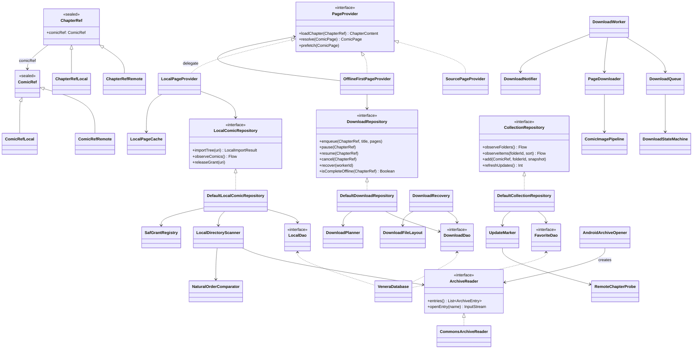
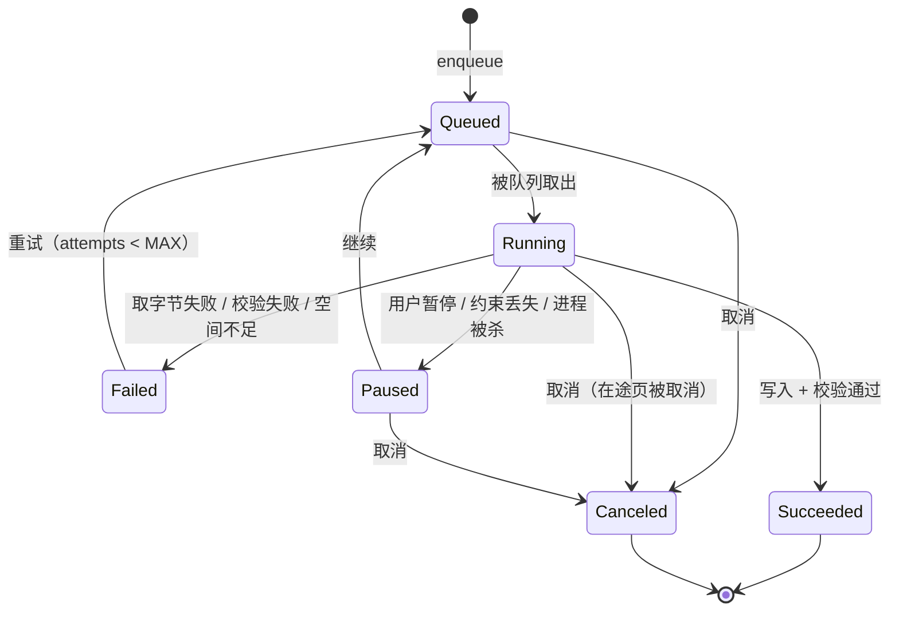
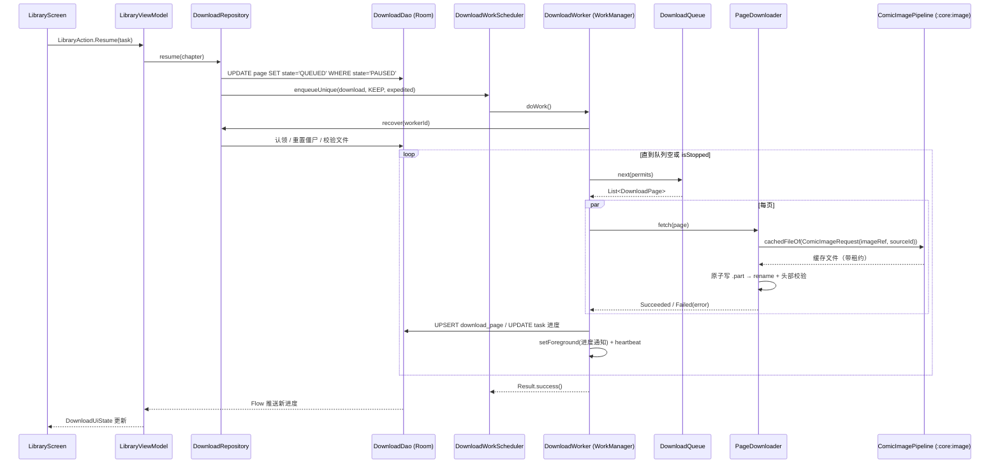
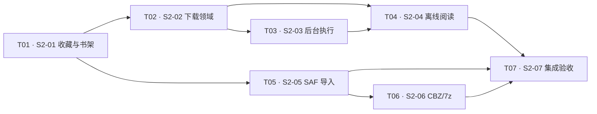

# Stage 2 增量设计：书架与离线能力（S2-01 — S2-07）

- 作者：高见远（架构师）
- 日期：2026-09-22
- 基线：`main`，Stage 0 / Stage 1 DONE（`docs/reviews/stage-01-final.md`），当前唯一任务 S2-01
- 工具链：AGP 9.2.1 / Gradle 9.4.1 / JDK 17 / compileSdk 37 / minSdk 26 / **KGP 2.2.10（不能读 Kotlin 2.4 元数据）** / KSP 2.3.10
- 上游文档：`AGENTS.md`、`docs/STATUS.md`、`docs/ARCHITECTURE.md`、`docs/IMPLEMENTATION_PLAN.md` §6、`docs/PROJECT_PLAN.md` §8/§9/§15、`docs/reviews/stage-01-final.md`、`docs/design/S1-incremental-design.md`

本文只设计 Stage 2。不提前实现 Stage 3（账户/收藏远端同步）与 Stage 4（DataStore 设置、WebDAV、自适应布局）的东西，也不留下半成品接口。

---

## 1. 依赖选型与版本核实

核实方式：WebSearch 官方 Release Notes + 直接拉取 POM（`dl.google.com` / `repo1.maven.org`）读 `<dependency>`，不凭记忆。

### 1.1 结论表

| 依赖 | 版本 | 许可证 | 核实依据 | Kotlin 元数据风险 |
| --- | --- | --- | --- | --- |
| `androidx.work:work-runtime-ktx` | **2.11.2** | Apache-2.0 | AndroidX Releases：`work` 最新稳定版 2.11.2（2026-08-12 更新通道），2.12.0 仍为 rc | `work-runtime-2.11.2.pom` → `org.jetbrains.kotlin:kotlin-stdlib:2.1.20`、`kotlinx-coroutines-android:1.9.0`。**2.1.20 远低于 KGP 2.2.10，可读** ✅ |
| `androidx.work:work-testing` | 2.11.2 | Apache-2.0 | 同上（官方 `androidTestImplementation` 用法） | 同上 |
| `androidx.documentfile:documentfile` | **1.1.0** | Apache-2.0 | `dl.google.com/.../documentfile/maven-metadata.xml` → `<release>1.1.0</release>` | 纯 Java |
| `org.apache.commons:commons-compress` | **1.28.0** | **Apache-2.0** | `repo1.maven.org/.../commons-compress/maven-metadata.xml` → `<release>1.28.0</release>`；POM `maven.compiler.source/target=1.8`、`commons.release.next=1.28.1`（RC） | **纯 Java，无 Kotlin 元数据**，不受 KGP 限制 ✅ |
| `org.tukaani:xz` | **1.10** | Public Domain / 0BSD | commons-compress 1.28.0 POM 将 xz 1.10 声明为 optional 依赖；官方格式页明确「7z 的 LZMA(2) 需要 XZ for Java」 | 纯 Java |
| Proto DataStore | **不引入** | — | 见 §1.3 | — |

`work-runtime` 传递引入 `androidx.room:room-runtime:2.7.0` 与 `androidx.core:core:1.12.0`：Gradle 会分别抬到本项目已有的 2.8.5 / 1.19.0，WorkManager 用自己的数据库文件（`androidx.work.workdb`），与 `venera.db` 不冲突，无需额外处理。

### 1.2 归档/压缩库选型（关键决策 1）

**选择：commons-compress 1.28.0（Apache-2.0）+ org.tukaani:xz 1.10（Public Domain）。**

理由：

1. **许可证**：本项目上游为 GPL-3.0，`AGENTS.md` §2 要求复用前确认许可证影响。commons-compress 是 Apache-2.0，xz 是 Public Domain，**都不触发 Copyleft**。
2. **候选 7-Zip-JBinding（含 `-4Android`）已否决**：它是 **LGPL-2.1**（Java 绑定层与 native 层同为 LGPL，见 `github.com/omicronapps/7-Zip-JBinding-4Android#issues/35` 维护者答复）。Android 上 Java 库无法被用户替换/重链接，LGPL 的替换义务实际上无法满足；且部分分发只走 JitPack。这与本项目对许可证的敏感程度冲突，**不引入**。
3. **CBZ/ZIP 不用额外库也能做，但统一到一个抽象更省事**：`java.util.zip.ZipFile` 只能接受 `File`，而 SAF 给的是 `Uri`。commons-compress 的 `ZipFile(SeekableByteChannel)` 与 `SevenZFile(SeekableByteChannel)` 都能直接吃 `contentResolver.openFileDescriptor()` 得到的 `FileChannel`，**zip 与 7z 共用一条随机访问通路**，不必为 SAF 先落一份临时副本。
4. **能力边界（必须登记为已知限制）**：官方格式页写明 7z「可读取大多数压缩与加密归档，但只能写未加密的」；lzma/lzma2/bzip2/deflate/DEFLATE64/AES-256 可读。不支持 RAR（PROJECT_PLAN 也未要求）。加密 7z 的覆盖率以官方说明为准，不在 Stage 2 承诺「全部 7z 可解」。

实现约束（写进 ADR-0010）：

- 只用 `ZipFile(SeekableByteChannel)` / `SevenZFile(SeekableByteChannel)`，**不用** `builder().setPath(Path)` 系列（它们引用 `java.nio.file`，Android 无此包）。
- `SeekableByteChannel` 由 `ParcelFileDescriptor` 经 `FileInputStream(pfd.fileDescriptor).channel` 提供；通道必须**独占**（每次 open 一个新 FD），并用 `try/finally` 关闭。
- `:core:archive` 是唯一 import `org.apache.commons.compress.*` 的模块。

### 1.3 为什么不引入 DataStore

- Stage 2 需要持久化的「非结构化偏好」只有两类：SAF 授权 URI（结构化，进 Room）、下载约束开关（Wi-Fi 仅/充电时，Stage 4 的设置项）。
- `ARCHITECTURE.md` §10 已明确「Proto DataStore：全局设置和阅读器偏好」，归属 **S4-01**。为避免与 Stage 4 抢定义，Stage 2 **不引入 DataStore，也不新增 SharedPreferences**；下载约束先用「默认仅 Wi-Fi + 不要求充电」的领域默认值（常量），等 S4-01 再做成设置项。
- SAF 授权：`FLAG_GRANT_READ_URI_PERMISSION | FLAG_GRANT_PERSISTABLE_URI_PERMISSION` + `takePersistableUriPermission()`，并把 `(uri, kind, granted_at)` 写进 Room `local_grant`（这就是「权限持久化」的验收项）。

### 1.4 下载执行模型（关键决策 2）

**选择 WorkManager 2.11.2 的 `CoroutineWorker` + `setForeground()` + `setExpedited(RUN_AS_NON_EXPEDITED_WORK_REQUEST)`，不直接用 Android 14 UIDT JobScheduler。**

理由：官方「用户发起的数据传输」页明确写「如果你目前用 WorkManager 做短时、可中断的网络数据传输，继续用 WorkManager，而不是换成用户发起的数据传输作业」。UIDT 需要 `RUN_USER_INITIATED_JOBS` 权限和 `JobService`，而我们的下载本来就需要 WorkManager 的持久化、约束与重试。因此：

- 前台保活：Worker 实现 `getForegroundInfo()` 并在 `doWork()` 里 `setForeground(...)`（API 26+ 前台服务通知；API 34 需要 `FOREGROUND_SERVICE_DATA_SYNC` 类型声明）。
- 立即性：用户手动点「开始」时用 `setExpedited(OutOfQuotaPolicy.RUN_AS_NON_EXPEDITED_WORK_REQUEST)`；配额耗尽自动退化为普通工作，不失败。
- 约束：`NetworkType.UNMETERED`（默认）、`setRequiresStorageNotLow(true)`；约束不满足时 WorkManager 自己等待，Worker 不轮询。
- 不使用 `work-multiprocess`（单进程足够）、不使用 `PeriodicWorkRequest`（追更检查不是定时轮询，见 §4.3）。

### 1.5 Version Catalog 新增（`gradle/libs.versions.toml`）

```toml
[versions]
work = "2.11.2"
documentfile = "1.1.0"
commonsCompress = "1.28.0"
# Pinned to the version commons-compress 1.28.0 declares/tests against (1.12 exists but is newer
# than the matrix upstream builds with).
xz = "1.10"

[libraries]
androidx-work-runtime-ktx = { module = "androidx.work:work-runtime-ktx", version.ref = "work" }
androidx-work-testing = { module = "androidx.work:work-testing", version.ref = "work" }
androidx-documentfile = { module = "androidx.documentfile:documentfile", version.ref = "documentfile" }
commons-compress = { module = "org.apache.commons:commons-compress", version.ref = "commonsCompress" }
xz = { module = "org.tukaani:xz", version.ref = "xz" }
```

不需要新的约定插件：新模块都用已有的 `venera.android.library` / `venera.android.compose.library`；`:core:database` 继续用 `venera.android.room.library`。

---

## 2. 每个 S2-XX 的详细验收标准

> 每条都能单独打勾；「测试点」是必须新增的同层测试（`AGENTS.md` §5）。普通节点只保证编译，关键节点才跑全量（AGENTS §7）。

### S2-01 本地收藏与书架

1. `favorite_folder` / `favorite_entry` 表由 Room v2 迁移产生，`schemas/2.json` 已提交，迁移测试通过（见 §5）。
2. `CollectionRepository` 提供：文件夹增删改名与排序、漫画加入/移出文件夹、移动、按文件夹过滤。
3. 书架列表支持排序：加入时间、标题、最近阅读、更新时间；排序是**仓库层查询参数**，不是 UI 里 `sortedBy`。
4. 更新标记：`UpdateMarker` 用「远端章节数 / 最新章节 id」与库里快照比对，`hasUpdate` 落库并可被清空（已读更新）。
5. Room 是唯一事实来源：UI 状态来自 `Flow`，进程重建后书架内容与顺序一致（不依赖内存缓存）。
6. 未加入任何文件夹的漫画有默认文件夹（id = `default`），不可删除。
7. 测试点：
   - `DefaultCollectionRepositoryTest`（假 DAO）：加入/移出/移动/重命名/删除文件夹级联；同名漫画重复加入幂等；排序四选项各自断言首项。
   - `UpdateMarkerTest`：章节数增加 → `hasUpdate = true`；相同 → false；章节数变少（源删章）→ 保留 false 且更新快照；清空标记后不再上报。
   - `LibraryViewModelTest`：加载/空/失败/成功四态；切换文件夹与排序只发一次查询。

### S2-02 下载领域与持久队列

1. `download_task` / `download_page` 表（v3）与 `schemas/3.json`。
2. 页级任务：入队以「章节 + 已解析的 `List<SourcePage>`」为输入，每页一行，带 `imageRef`、`index`。
3. 状态机：`Queued → Running → Succeeded | Failed`；`Running → Paused`（用户暂停/约束丢失/进程被杀）；`Paused|Failed → Queued`（继续/重试）；`Canceled` 终态。章节状态由页状态派生。
4. 暂停：不丢已完成页；继续：从第一个非 `Succeeded` 页继续。
5. 取消：删除行 + 删除已下载文件；取消后目录不留残余。
6. 恢复扫描：进程被杀后启动，`Running` 且心跳过期的页回到 `Queued`；`Succeeded` 但文件缺失/大小为 0 的页回到 `Queued`；数据库中行丢失但 `chapter.json` 存在时按元数据重建（见 §6.3）。
7. 页写入原子：`.part` → `rename`；写后用 `:core:image` 的 `ImageSizeHeaderParser` 做完整性校验，失败计 `Failed` 而不是算完成。
8. 测试点：
   - `DownloadStateMachineTest`：全部合法/非法迁移（含 `Canceled` 不可复活、`Succeeded` 不可回退）。
   - `DownloadQueueTest`：全局并发上限 4、单源上限 2；章节 FIFO、章节内页序；暂停后已在途页允许完成但不再取新页。
   - `DefaultDownloadRepositoryTest`（假 DAO）：入队幂等（重复入队不产生重复页行）、进度聚合、取消级联删行。
   - `DownloadRecoveryTest`：心跳过期重置、文件缺失重置、孤儿文件收养、孤儿文件清理（无主且不在任何 chapter.json 里）。
   - `DownloadFileLayoutTest`：路径稳定哈希、非法字符/超长 id 不破坏路径。

### S2-03 Android 后台下载执行

1. `DownloadWorker`（`CoroutineWorker`）：从 DB 取页 → 拉字节 → 原子写 → 更新状态 → 循环至队列空或被停止。
2. 通知：进度通知（章节名 + 已完成/总数）、暂停/继续/取消三个 action（`PendingIntent` 走 Worker 的 `setForeground` 或 `WorkManager` 取消）。
3. 约束：默认 `NetworkType.UNMETERED` + `setRequiresStorageNotLow(true)`；用户手动开始时 `setExpedited`。
4. 唯一工作串：`UniqueWorkPolicy.KEEP` 的 `download` 唯一工作；暂停时不返回 `Result.failure()`（否则触发重试）。
5. 权限与类型：manifest 声明 `POST_NOTIFICATIONS`、`FOREGROUND_SERVICE`、`FOREGROUND_SERVICE_DATA_SYNC`（API 34+）；Lint 不新增 baseline。
6. Worker 不依赖 Activity：`DownloadWorker` 通过 `DownloadEnvironment.get(context)` 取依赖（见 §3.6），进程冷启动也能跑。
7. 测试点：
   - `DownloadWorkerTest`（`androidTest`，`work-testing` 的 `TestListenableWorkerBuilder`）：空队列立即成功；取消后不再写文件；`getForegroundInfo()` 非空且 channel id 合法（普通节点只保证 `compileDebugAndroidTestKotlin`）。
   - `DownloadNotifierTest`（`androidTest` 或 JVM + Robolectric 免）：至少保证通知文案与 action 常量在无 `Context` 的纯函数中可测（文案映射放 `DownloadNotificationText`）。

### S2-04 离线阅读整合

1. `:core:model` 新增 `ComicRef` / `ChapterRef` 统一身份（见 §4.1），`PageProvider.loadChapter(ChapterRef)`。
2. `OfflineFirstPageProvider`：章节全部页 `Succeeded` 且文件存在 → 直接用本地文件（`sourceId = null`、`imageRef = 绝对路径`）；否则回落到注入的 `SourcePageProvider`。
3. 断开网络（飞行模式）后，已下载章节能进阅读器、能翻页、能按 `:core:image` 的 `Region`/`Sampled` 解码。
4. 进度：离线章节的阅读进度与在线章节走同一套 `HistoryRepository`（本地章节用保留命名空间，见 §4.2）。
5. 不引入第二套离线 UI：阅读器与 `ReaderRoute` 不变，只改 `chapter` 参数类型。
6. 测试点：
   - `OfflineFirstPageProviderTest`：全完成 → 全本地页（`sourceId == null` 且文件存在）；部分完成 → 回落；文件被删 → 回落且不崩。
   - `ChapterRefEncodingTest`（`:core:navigation`）：`remote`/`local` 两种路由往返编码、非法串返回 null、旧版 `reader:` 四段串仍可解（向后兼容）。
   - `ReaderViewModelTest` 增量：给定 `ChapterRef.Local` 也能进 `Ready`。

### S2-05 SAF 本地目录导入

1. `ACTION_OPEN_DOCUMENT_TREE` 选择目录，`takePersistableUriPermission()`，`local_grant` 落库；授权列表可展示、可释放（释放后扫描失败有明确错误态）。
2. 目录形态识别：无章节子目录（图片直接在根）与章节子目录两种。
3. 自然排序：`NaturalOrderComparator`（`2 < 10`，`ch1 < ch1.5`？— 至少覆盖数字段、前导零、大小写不敏感），排序结果稳定可复现。
4. 封面识别：`cover.*`（任意图片扩展）优先，否则首张图片；封面参与 `LocalComic` 落库。
5. 导入结果进入 `local_comic` / `local_chapter` / `local_page`（v4），导入是**增量**的：重复导入同一棵树幂等，删除的目录会从库中移除。
6. 测试点：
   - `NaturalOrderComparatorTest`：`1,2,10`、`a1,a1b,a2`、`v01,v02,v10`、空与相等。
   - `LocalDirectoryScannerTest`（用 JVM 临时目录 + 假 `DocumentFile` 抽象）：两种形态、非图片文件被忽略、嵌套过深被忽略、幂等。
   - `LocalCoverResolverTest`：`cover.jpg` 优先于 `001.jpg`；无图片时返回 null 且 UI 有占位。
   - `DefaultLocalComicRepositoryTest`（假 DAO）：导入/幂等/删除树级联/授权释放。

### S2-06 CBZ/ZIP 与 7z 系列

1. `:core:archive` 提供 `ArchiveReader`：`entries()` 与 `openEntry(name): InputStream`。
2. 支持 zip/cbz（commons-compress `ZipFile`）与 7z/cb7（`SevenZFile` + xz）；格式按 MIME 与扩展名判定，未知格式返回 `ArchiveError.Unsupported` 而不是崩溃。
3. 索引缓存：压缩包内的页条目在导入时写进 `local_page`，阅读时**不再重新打开压缩包列举**。
4. `ArchiveEntry` 页面：`LocalPageProvider` 把条目字节物化到 `cacheDir/local-pages` 后返回本地路径（见 §7），LRU 上限（默认 256 MiB）淘汰。
5. 错误恢复：单个条目损坏 → 该页标记不可用并可重试，不让整章失败；压缩包整体损坏 → 章节级 `Failed` 且 UI 可重试。
6. 测试点：
   - `ArchiveIndexTest`（JVM）：用 `java.util.zip` 生成 zip fixture、用 commons-compress 写 7z fixture，断言条目数、顺序、随机读取某条目字节一致。
   - `ArchiveErrorTest`：截断的 zip、非归档文件、加密 7z → 各自映射到对应 `ArchiveError`。
   - `LocalPageProviderTest`：`loadChapter` 返回 `sourceId == null` 且文件真实存在；LRU 淘汰后再次请求能重建；条目损坏时该页被跳过并有失败计数。

### S2-07 Stage 2 集成验收

1. `:app` 装配：书架路由、SAF 选择器、下载 Worker 依赖、按 `ChapterRef` 选择 provider；`:app` 不新增业务实现（只有装配与适配器）。
2. 飞行模式人工脚本（写进 `docs/STATUS.md`，不写成「已验证」）：书架可见收藏/下载/本地 → 打开已下载章节 → 翻页 → 退出重进恢复进度 → 打开本地导入漫画 → 阅读并保存进度。
3. 自动化门禁：`sh gradlew --offline --no-daemon --max-workers=2 lintDebug testDebugUnitTest :app:assembleDebug :app:assembleRelease` PASS，无新增 lint baseline/suppress。
4. 依赖与许可证：`THIRD_PARTY_NOTICES.md` 增补 WorkManager / documentfile / commons-compress / xz 四项及其许可证；ADR-0005（下载执行）、ADR-0010（归档库选型与许可证）、ADR-0011（身份统一）已创建并更新 `docs/adr/README.md`。
5. 文档：`STATUS.md` / `IMPLEMENTATION_PLAN.md` / `ARCHITECTURE.md` / `README.md` 同步；`:core:database` schema 1→4 全部入库。
6. 测试点：`:feature:library` 的 `LibraryScreenTest`（Compose，空/加载/成功/失败四态）+ `:app` 级别的路由装配冒烟（`AppRoute` → provider 选择：remote 已下载 → 离线 provider；local → 本地 provider）。

---

## 3. 新模块结构与文件清单

新增 5 个模块（`:core:archive`、`:data:collection`、`:data:download`、`:data:local`、`:feature:library`），全部满足 `ARCHITECTURE.md` §5 的建模块准则（有本阶段交付物、一句话职责、明确调用方、能独立测试或隔离第三方）。**不为以后创建空模块**：不建 `:data:reader`、不建 `:core:settings`（归 S4-01）。

### 3.1 `:core:archive`（新）

```text
core/archive/build.gradle.kts
core/archive/src/main/kotlin/dev/veneranative/core/archive/
├── ArchiveFormat.kt             # enum { Zip, SevenZip } + 从 displayName/mime 判定
├── ArchiveEntry.kt              # data class ArchiveEntry(name, sizeBytes, isDirectory)
├── ArchiveReader.kt             # interface：entries() / openEntry(name) / close()
├── ArchiveError.kt              # sealed：Unsupported / Corrupt / EntryMissing / Io（脱敏）
├── AndroidArchiveOpener.kt      # Uri + ContentResolver → ParcelFileDescriptor → SeekableByteChannel
├── CommonsArchiveReader.kt      # commons-compress ZipFile / SevenZFile 实现
├── NaturalOrderComparator.kt    # 纯 Kotlin 自然排序
core/archive/src/test/kotlin/dev/veneranative/core/archive/
├── NaturalOrderComparatorTest.kt
├── ArchiveIndexTest.kt          # JVM：java.util.zip 造 zip、commons-compress 造 7z 并读回
└── ArchiveErrorTest.kt          # 截断/非归档/不支持 → 映射
core/archive/src/androidTest/kotlin/dev/veneranative/core/archive/
└── AndroidArchiveOpenerTest.kt  # 需要 SAF，普通节点只保证编译
```

```kotlin
// core/archive/build.gradle.kts
plugins { id("venera.android.library") }
android { namespace = "dev.veneranative.core.archive" }
dependencies {
    implementation(libs.androidx.documentfile)
    implementation(libs.commons.compress)
    implementation(libs.xz)                 // 7z 的 LZMA/LZMA2 解码，commons-compress 声明为 optional
    implementation(libs.kotlinx.coroutines.core)
    testImplementation(libs.junit4)
    testImplementation(libs.kotlinx.coroutines.test)
    androidTestImplementation(libs.androidx.test.ext.junit)
    androidTestImplementation(libs.androidx.test.runner)
}
```

### 3.2 `:data:collection`（新）

```text
data/collection/build.gradle.kts
data/collection/src/main/kotlin/dev/veneranative/data/collection/
├── CollectionRepository.kt      # 契约 + 领域模型 FavoriteFolder / FavoriteItem / ShelfSort / UpdateState
├── DefaultCollectionRepository.kt
├── CollectionMappers.kt         # 实体 ↔ 领域
├── UpdateMarker.kt              # 远端章节快照 → hasUpdate（纯逻辑，注入 probe）
└── RemoteChapterProbe.kt        # interface：suspend chapterSnapshot(ComicKey): ChapterSnapshot?
data/collection/src/test/kotlin/dev/veneranative/data/collection/
├── FakeFavoriteDaos.kt
├── DefaultCollectionRepositoryTest.kt
└── UpdateMarkerTest.kt
```

```kotlin
// data/collection/build.gradle.kts
plugins { id("venera.android.library") }
android { namespace = "dev.veneranative.data.collection" }
dependencies {
    api(project(":core:model"))
    implementation(project(":core:database"))
    implementation(project(":data:comic"))     // 只为了 RemoteChapterProbe 的默认实现由 :app 注入；
                                               // 若实现期判定为循环风险，改为 :app 注入 probe（见 §10.3）
    implementation(libs.kotlinx.coroutines.core)
    testImplementation(libs.junit4)
    testImplementation(libs.kotlinx.coroutines.test)
}
```

### 3.3 `:data:download`（新）

```text
data/download/build.gradle.kts
data/download/src/main/kotlin/dev/veneranative/data/download/
├── DownloadRepository.kt        # 契约 + 领域模型（DownloadTask / DownloadPage / DownloadStatus / DownloadConstraints）
├── DefaultDownloadRepository.kt
├── DownloadMappers.kt
├── DownloadFileLayout.kt        # 稳定哈希路径、chapter.json / metadata.json、原子写入（纯逻辑可测）
├── DownloadPlanner.kt           # chapter + List<SourcePage> → 页级任务行
├── DownloadStateMachine.kt      # 合法迁移（纯函数）
├── DownloadQueue.kt             # 并发与顺序策略（纯逻辑：双信号量 + FIFO）
├── PageDownloader.kt            # 取字节 → 原子写 → 完整性校验
├── DownloadRecovery.kt          # 心跳/文件校验/孤儿收养
├── DownloadEnvironment.kt       # object：Worker 无 Activity 时的依赖入口（见 §3.6）
├── OfflineFirstPageProvider.kt
├── ChapterManifest.kt           # chapter.json 的读写（kotlinx.serialization 树 API 或 org.json，与 :source:api 一致）
├── worker/DownloadWorker.kt
├── worker/DownloadWorkScheduler.kt
└── worker/DownloadNotifier.kt
data/download/src/test/kotlin/dev/veneranative/data/download/
├── FakeDownloadDaos.kt
├── DownloadStateMachineTest.kt
├── DownloadQueueTest.kt
├── DownloadFileLayoutTest.kt
├── DefaultDownloadRepositoryTest.kt
├── DownloadRecoveryTest.kt
└── OfflineFirstPageProviderTest.kt
data/download/src/androidTest/kotlin/dev/veneranative/data/download/
└── worker/DownloadWorkerTest.kt  # work-testing；普通节点只保证 compileDebugAndroidTestKotlin
```

```kotlin
// data/download/build.gradle.kts
plugins { id("venera.android.library") }
android { namespace = "dev.veneranative.data.download" }
dependencies {
    api(project(":core:model"))
    implementation(project(":core:database"))
    implementation(project(":core:image"))     // ComicImagePipeline：带鉴权取页字节（见 §6.2）
    implementation(project(":core:network"))   // 共享 OkHttp 的 dispatcher/连接池语义
    implementation(libs.androidx.work.runtime.ktx)
    implementation(libs.androidx.core.ktx)     // 通知
    implementation(libs.kotlinx.coroutines.core)
    testImplementation(libs.junit4)
    testImplementation(libs.kotlinx.coroutines.test)
    androidTestImplementation(libs.androidx.work.testing)
    androidTestImplementation(libs.androidx.test.ext.junit)
    androidTestImplementation(libs.androidx.test.runner)
    androidTestImplementation(libs.kotlinx.coroutines.test)
}
```

### 3.4 `:data:local`（新）

```text
data/local/build.gradle.kts
data/local/src/main/kotlin/dev/veneranative/data/local/
├── LocalComicRepository.kt      # 契约 + 领域模型 LocalComic / LocalChapter / LocalPage / LocalKind
├── DefaultLocalComicRepository.kt
├── LocalMappers.kt
├── SafGrantRegistry.kt          # takePersistableUriPermission + releasePersistableUriPermission + 落库
├── LocalDirectoryScanner.kt     # 树 → 漫画/章节/页（自然排序、封面）
├── LocalCoverResolver.kt
├── LocalPageCache.kt            # SAF/压缩包条目 → cacheDir 真实文件，LRU
└── LocalPageProvider.kt         # PageProvider 实现
data/local/src/test/kotlin/dev/veneranative/data/local/
├── FakeLocalDaos.kt
├── LocalDirectoryScannerTest.kt
├── LocalCoverResolverTest.kt
├── DefaultLocalComicRepositoryTest.kt
└── LocalPageProviderTest.kt
data/local/src/androidTest/kotlin/dev/veneranative/data/local/
└── SafGrantRegistryTest.kt
```

```kotlin
// data/local/build.gradle.kts
plugins { id("venera.android.library") }
android { namespace = "dev.veneranative.data.local" }
dependencies {
    api(project(":core:model"))
    implementation(project(":core:archive"))
    implementation(project(":core:database"))
    implementation(libs.androidx.documentfile)
    implementation(libs.kotlinx.coroutines.core)
    testImplementation(libs.junit4)
    testImplementation(libs.kotlinx.coroutines.test)
    androidTestImplementation(libs.androidx.test.ext.junit)
    androidTestImplementation(libs.androidx.test.runner)
}
```

### 3.5 `:feature:library`（新）

```text
feature/library/build.gradle.kts
feature/library/src/main/kotlin/dev/veneranative/feature/library/
├── LibraryRoute.kt              # 参数：CollectionRepository / DownloadRepository / LocalComicRepository + 回调
├── LibraryScreen.kt
├── LibraryViewModel.kt
├── LibraryUiState.kt            # 三个 tab：收藏 / 下载 / 本地；每 tab 有 加载/空/成功/失败
├── LibraryAction.kt
└── component/{FavoriteGrid.kt, DownloadList.kt, LocalGrid.kt, FolderChips.kt}
feature/library/src/test/kotlin/dev/veneranative/feature/library/
├── LibraryViewModelTest.kt
└── FakeRepositories.kt
```

```kotlin
// feature/library/build.gradle.kts
plugins { id("venera.android.compose.library") }
android { namespace = "dev.veneranative.feature.library" }
dependencies {
    implementation(project(":core:model"))
    implementation(project(":core:designsystem"))
    implementation(project(":core:image"))        // ComicImage 渲染封面
    implementation(project(":data:collection"))
    implementation(project(":data:download"))
    implementation(project(":data:local"))
    implementation(platform(libs.compose.bom))
    implementation(libs.compose.foundation)
    implementation(libs.compose.material3)
    implementation(libs.compose.ui)
    implementation(libs.compose.ui.tooling.preview)
    implementation(libs.androidx.lifecycle.runtime.compose)
    implementation(libs.androidx.lifecycle.viewmodel.compose)
    testImplementation(libs.junit4)
    testImplementation(libs.kotlinx.coroutines.test)
    androidTestImplementation(platform(libs.compose.bom))
    androidTestImplementation(libs.compose.ui.test.junit4)
    androidTestImplementation(libs.androidx.test.ext.junit)
    androidTestImplementation(libs.androidx.test.runner)
    debugImplementation(libs.compose.ui.test.manifest)
}
```

### 3.6 既有模块的改动清单

| 模块 | 改动 |
| --- | --- |
| `:core:model` | 新增 `ComicRef.kt`（`ComicRef` / `ChapterRef` / `LocalComicId` / `LocalChapterId` / `LOCAL_REF_NAMESPACE`）；`PageProvider.loadChapter(chapter: ChapterRef)`；新增测试 `ComicRefTest`。**仍不依赖 Android / Compose / 数据库 / 网络** |
| `:core:database` | 8 张新表的 Entity/DAO、`version = 4`、`Migrations.kt`、`schemas/{2,3,4}.json`、androidTest 迁移与 DAO 测试（§5） |
| `:core:navigation` | `AppRoute.Library`、`AppRoute.Reader(chapter: ChapterRef)`；`AppRouteEncoding` 支持 `remote` / `local` 两种 reader 编码并向后兼容旧四段串；新增往返测试 |
| `:core:image` | 新增 `ComicImageEnvironment`（`object`：安装/获取进程级 `ComicImagePipeline`，供 Worker 使用）。**不改任何解码行为** |
| `:data:history` | `RefEncoding`：`ComicRef`/`ChapterRef` ↔ `(source_id, comic_id, chapter_id)` 字符串列；本地用保留命名空间（§4.2）；现有 `ReadingProgressTracker` 语义不变 |
| `:data:comic` | `SourcePageProvider.loadChapter(ref: ChapterRef)`：`Local` 时抛 `IllegalArgumentException`（契约外），并补测试 |
| `:data:source` | 安装校验新增：来源 `key` 不得以 `@` 开头（保留给本地命名空间），配 1 条测试 |
| `:feature:home` | 首页加入口「书架」「本地导入」 |
| `:feature:details` | 收藏按钮（选文件夹）+ 章节多选下载（依赖 `:data:download`） |
| `:feature:reader` | `ReaderRoute`/`ReaderViewModel` 的 `chapter: ChapterKey` → `ChapterRef`；其余不变 |
| `:app` | `VeneraApplication`（安装 `ComicImageEnvironment` 与 `DownloadEnvironment`）、`AppGraph` 增三个仓库与 provider 选择、`AppNavHost` 增 Library 路由与 SAF 选择器、`AndroidManifest.xml` 增权限与 `application android:name` |
| `settings.gradle.kts` / `libs.versions.toml` / `THIRD_PARTY_NOTICES.md` | 新模块与新依赖、许可证声明 |

---

## 4. 核心接口设计

> 签名表达形状；实现时用 IDE/源码核对第三方 API（`AGENTS.md` §3 禁止凭记忆猜 API）。

### 4.1 身份统一（`:core:model`，纯 Kotlin）

```kotlin
package dev.veneranative.core.model

@JvmInline value class LocalComicId(val value: String) {
    init { require(value.isNotBlank()) { "LocalComicId must not be blank" } }
}

@JvmInline value class LocalChapterId(val value: String) {
    init { require(value.isNotBlank()) { "LocalChapterId must not be blank" } }
}

/**
 * A comic the app can open, wherever its pages come from.
 *
 * Sealed (not a tagged string) so a caller cannot accidentally hand a local id to a source call:
 * the reader asks for pages by [ChapterRef] and each implementation handles the half it owns.
 */
sealed interface ComicRef {
    data class Remote(val key: ComicKey) : ComicRef
    data class Local(val id: LocalComicId) : ComicRef
}

sealed interface ChapterRef {
    data class Remote(val key: ChapterKey) : ChapterRef
    data class Local(val comicId: LocalComicId, val chapterId: LocalChapterId) : ChapterRef

    val comicRef: ComicRef
        get() = when (this) {
            is Remote -> ComicRef.Remote(key.comicKey)
            is Local -> ComicRef.Local(comicId)
        }
}
```

`PageProvider` 的契约随之收窄为「接受哪种 ref」由实现声明：

```kotlin
interface PageProvider {
    suspend fun loadChapter(chapter: ChapterRef): ChapterContent
    suspend fun resolve(page: ComicPage): ComicPage = page
    suspend fun prefetch(page: ComicPage) = Unit
}
```

### 4.2 保留命名空间（进度/历史复用）

`reading_history` / `reading_progress` 的主键是 `(source_id, comic_id, chapter_id)` 三列字符串。**不为此改表**，在 `:data:history` 里做一层编码：

```kotlin
package dev.veneranative.data.history

/**
 * Encodes a [ComicRef] into the three string columns the Room schema already has.
 *
 * Local comics use the reserved source namespace `@local`; `:data:source` rejects source keys that
 * start with `@`, so a script can never collide with it. Adding a `kind` column would be cleaner but
 * would force a migration of the only table Stage 1 already ships.
 */
internal object RefEncoding {
    const val LOCAL_SOURCE = "@local"
    fun sourceIdOf(ref: ComicRef): String = when (ref) {
        is ComicRef.Remote -> ref.key.sourceId.value
        is ComicRef.Local -> LOCAL_SOURCE
    }
    fun comicIdOf(ref: ComicRef): String = when (ref) {
        is ComicRef.Remote -> ref.key.remoteId.value
        is ComicRef.Local -> ref.id.value
    }
    fun chapterIdOf(ref: ChapterRef): String = when (ref) {
        is ChapterRef.Remote -> ref.key.remoteId.value
        is ChapterRef.Local -> ref.chapterId.value
    }
    fun comicRefOf(sourceId: String, comicId: String): ComicRef? = ...
}
```

### 4.3 收藏（`:data:collection`）

```kotlin
data class FavoriteFolder(val id: String, val name: String, val sortOrder: Int, val removable: Boolean)

data class FavoriteItem(
    val ref: ComicRef,
    val title: String,
    val subtitle: String? = null,
    val coverUrl: String? = null,          // 远端为 URL，本地为物化后的路径/URI 字符串
    val folderId: String,
    val addedAtEpochMillis: Long,
    val lastReadAtEpochMillis: Long? = null,
    val chapterCount: Int? = null,         // 最近一次追更快照
    val latestChapterId: String? = null,
    val hasUpdate: Boolean = false,
)

enum class ShelfSort { AddedAt, Title, LastRead, Updated }

interface CollectionRepository {
    fun observeFolders(): Flow<List<FavoriteFolder>>
    fun observeItems(folderId: String?, sort: ShelfSort): Flow<List<FavoriteItem>>
    suspend fun createFolder(name: String): String
    suspend fun renameFolder(id: String, name: String)
    suspend fun deleteFolder(id: String)                       // 内容移到 default，default 不可删
    suspend fun add(ref: ComicRef, folderId: String, snapshot: ComicSnapshot)
    suspend fun remove(ref: ComicRef)
    suspend fun moveTo(ref: ComicRef, folderId: String)
    suspend fun clearUpdate(ref: ComicRef)
    suspend fun refreshUpdates(): Int                          // 返回被标记更新的数量
}

/** 追更：远端快照与库内快照比较。probe 由装配层注入，仓库不认识来源。 */
class UpdateMarker(private val probe: RemoteChapterProbe) {
    suspend fun evaluate(stored: FavoriteItem): UpdateState
}
```

### 4.4 下载（`:data:download`）

```kotlin
enum class DownloadPageState { Queued, Running, Succeeded, Failed, Paused, Canceled }
enum class DownloadChapterState { Queued, Running, Paused, Completed, Partial, Failed, Canceled }

data class DownloadTask(
    val chapter: ChapterRef,
    val title: String,
    val comicTitle: String?,
    val pageCount: Int,
    val completedPages: Int,
    val state: DownloadChapterState,
    val createdAtEpochMillis: Long,
    val updatedAtEpochMillis: Long,
)

data class DownloadPage(
    val chapter: ChapterRef,
    val index: Int,
    val imageRef: String,
    val state: DownloadPageState,
    val relativePath: String? = null,   // 相对 downloads 根，避免绝对路径进库/进 UI
    val bytes: Long = 0L,
    val attempts: Int = 0,
    val lastError: DownloadError? = null,
)

sealed interface DownloadError {          // 领域错误，不把异常文案当产品文案
    data object Network : DownloadError
    data object StorageFull : DownloadError
    data class Corrupt(val reason: String) : DownloadError
    data object NotResolvable : DownloadError
}

interface DownloadRepository {
    fun observeTasks(): Flow<List<DownloadTask>>
    fun observeTask(chapter: ChapterRef): Flow<DownloadTask?>
    suspend fun enqueue(chapter: ChapterRef, title: String, pages: List<SourcePage>)
    suspend fun pause(chapter: ChapterRef)
    suspend fun resume(chapter: ChapterRef)
    suspend fun cancel(chapter: ChapterRef)
    suspend fun retryFailed(chapter: ChapterRef)
    /** 进程启动与 Worker 启动时都调用：见 §6.3。 */
    suspend fun recover(workerId: String)
    suspend fun isCompleteOffline(chapter: ChapterRef): Boolean
}
```

### 4.5 本地（`:data:local`）

```kotlin
data class LocalComic(
    val id: LocalComicId,
    val title: String,
    val kind: LocalKind,                 // Directory | Archive
    val rootUri: String,                 // SAF 树或归档文件 URI
    val coverPath: String?,              // 物化后的封面文件；null 时 UI 用占位
    val chapterCount: Int,
    val addedAtEpochMillis: Long,
)

data class LocalChapter(val id: LocalChapterId, val comicId: LocalComicId, val title: String, val index: Int)

interface LocalComicRepository {
    fun observeComics(): Flow<List<LocalComic>>
    fun observeChapters(comicId: LocalComicId): Flow<List<LocalChapter>>
    suspend fun importTree(uri: String): LocalImportResult      // 幂等
    suspend fun remove(comicId: LocalComicId)                   // 删库 + 释放授权（若为唯一持有者）
    suspend fun refresh(comicId: LocalComicId)
    suspend fun grants(): List<SafGrant>
    suspend fun releaseGrant(uri: String)
}
```

### 4.6 归档（`:core:archive`）

```kotlin
interface ArchiveReader : Closeable {
    fun entries(): List<ArchiveEntry>          // 已按自然排序
    fun openEntry(name: String): InputStream   // 调用方负责关闭
}

interface ArchiveOpener {
    /** [uri] 为 SAF 选中的归档文件；返回 null 表示格式不支持。 */
    fun open(uri: String): ArchiveReader?
}

sealed interface ArchiveError {
    data object Unsupported : ArchiveError
    data object Corrupt : ArchiveError
    data class EntryMissing(val name: String) : ArchiveError
    data class Io(val sanitized: String) : ArchiveError
}
```

### 4.7 类图



---

## 5. Room Schema 演进方案

### 5.1 版本节奏（一个任务一次迁移，独立 commit）

| 迁移 | 任务 | 新增表 |
| --- | --- | --- |
| **1 → 2** | S2-01 | `favorite_folder`、`favorite_entry` |
| **2 → 3** | S2-02 | `download_task`、`download_page` |
| **3 → 4** | S2-05（S2-06 起用 `local_page` 的归档字段） | `local_grant`、`local_comic`、`local_chapter`、`local_page` |

**为什么拆三次而不是一次 v2**：`AGENTS.md` §8.2 要求「一个任务一个 commit」，而 Room 的 `@Database(version)` 与实体清单是全局的。一次 v2 会让 S2-01 的 commit 里出现下载与本地的空表（等于提前实现）；三次迁移让每个 commit 只含本任务的 schema，也让 `MigrationTestHelper` 能逐步验证。代价是 3 个 Migration 对象，可接受。

**已评估的备选**：S2-05 与 S2-06 各升一次（共 4 次）。否决理由：S2-06 只给 `local_page` 增加归档相关列并写入数据，属于同一份「本地库」schema，分成两次会让 S2-05 的 `local_page` 先以目录形态落地再被 ALTER，收益为负。

### 5.2 Entity 要点（`ARCHITECTURE.md` §3：`:core:database` 不依赖 `:core:model`，主键一律字符串列）

```kotlin
// v2
@Entity(tableName = "favorite_folder", indices = [Index(value = ["sort_order"])])
data class FavoriteFolderEntity(
    @PrimaryKey @ColumnInfo(name = "folder_id") val folderId: String,
    @ColumnInfo(name = "name") val name: String,
    @ColumnInfo(name = "sort_order") val sortOrder: Int,
    @ColumnInfo(name = "removable") val removable: Boolean,
)

@Entity(
    tableName = "favorite_entry",
    primaryKeys = ["ref_source", "ref_comic"],
    indices = [Index(value = ["folder_id"]), Index(value = ["added_at"]), Index(value = ["has_update"])],
)
data class FavoriteEntryEntity(
    @ColumnInfo(name = "ref_source") val refSource: String,   // 远端为 sourceId，本地为 "@local"
    @ColumnInfo(name = "ref_comic") val refComic: String,
    @ColumnInfo(name = "folder_id") val folderId: String,
    @ColumnInfo(name = "title") val title: String,
    @ColumnInfo(name = "subtitle") val subtitle: String?,
    @ColumnInfo(name = "cover_ref") val coverRef: String?,
    @ColumnInfo(name = "added_at") val addedAt: Long,
    @ColumnInfo(name = "last_read_at") val lastReadAt: Long?,
    @ColumnInfo(name = "chapter_count") val chapterCount: Int?,
    @ColumnInfo(name = "latest_chapter_id") val latestChapterId: String?,
    @ColumnInfo(name = "has_update") val hasUpdate: Boolean,
)

// v3
@Entity(tableName = "download_task", indices = [Index(value = ["updated_at"])])
data class DownloadTaskEntity(
    @PrimaryKey @ColumnInfo(name = "task_id") val taskId: String,      // ChapterRef 的稳定编码
    @ColumnInfo(name = "ref_source") val refSource: String,
    @ColumnInfo(name = "ref_comic") val refComic: String,
    @ColumnInfo(name = "ref_chapter") val refChapter: String,
    @ColumnInfo(name = "title") val title: String,
    @ColumnInfo(name = "comic_title") val comicTitle: String?,
    @ColumnInfo(name = "page_count") val pageCount: Int,
    @ColumnInfo(name = "completed_pages") val completedPages: Int,
    @ColumnInfo(name = "state") val state: String,                     // 枚举名，不用 ordinal
    @ColumnInfo(name = "worker_id") val workerId: String?,              // 归属 token
    @ColumnInfo(name = "heartbeat_at") val heartbeatAt: Long,
    @ColumnInfo(name = "created_at") val createdAt: Long,
    @ColumnInfo(name = "updated_at") val updatedAt: Long,
)

@Entity(
    tableName = "download_page",
    primaryKeys = ["task_id", "page_index"],
    indices = [Index(value = ["state"])],
)
data class DownloadPageEntity(
    @ColumnInfo(name = "task_id") val taskId: String,                   // 带 ON DELETE CASCADE 的外键
    @ColumnInfo(name = "page_index") val pageIndex: Int,
    @ColumnInfo(name = "image_ref") val imageRef: String,
    @ColumnInfo(name = "state") val state: String,
    @ColumnInfo(name = "relative_path") val relativePath: String?,
    @ColumnInfo(name = "bytes") val bytes: Long,
    @ColumnInfo(name = "attempts") val attempts: Int,
    @ColumnInfo(name = "last_error") val lastError: String?,
)

// v4
@Entity(tableName = "local_grant")
data class LocalGrantEntity(
    @PrimaryKey @ColumnInfo(name = "uri") val uri: String,
    @ColumnInfo(name = "kind") val kind: String,                        // tree | archive
    @ColumnInfo(name = "granted_at") val grantedAt: Long,
)

@Entity(tableName = "local_comic", indices = [Index(value = ["added_at"])])
data class LocalComicEntity(
    @PrimaryKey @ColumnInfo(name = "comic_id") val comicId: String,
    @ColumnInfo(name = "title") val title: String,
    @ColumnInfo(name = "kind") val kind: String,                        // directory | archive
    @ColumnInfo(name = "root_uri") val rootUri: String,
    @ColumnInfo(name = "cover_path") val coverPath: String?,
    @ColumnInfo(name = "chapter_count") val chapterCount: Int,
    @ColumnInfo(name = "added_at") val addedAt: Long,
)

@Entity(tableName = "local_chapter", primaryKeys = ["comic_id", "chapter_id"])
data class LocalChapterEntity(
    @ColumnInfo(name = "comic_id") val comicId: String,
    @ColumnInfo(name = "chapter_id") val chapterId: String,
    @ColumnInfo(name = "title") val title: String,
    @ColumnInfo(name = "sort_index") val sortIndex: Int,
    @ColumnInfo(name = "entry_name") val entryName: String?,            // 归档内条目/子目录名
)

@Entity(
    tableName = "local_page",
    primaryKeys = ["comic_id", "chapter_id", "page_index"],
    indices = [Index(value = ["comic_id", "chapter_id"])],
)
data class LocalPageEntity(
    @ColumnInfo(name = "comic_id") val comicId: String,
    @ColumnInfo(name = "chapter_id") val chapterId: String,
    @ColumnInfo(name = "page_index") val pageIndex: Int,
    @ColumnInfo(name = "entry_name") val entryName: String,             // 目录：文档 id；归档：条目名
    @ColumnInfo(name = "display_name") val displayName: String,
    @ColumnInfo(name = "size_bytes") val sizeBytes: Long,
)
```

要点：

- 所有主键/外键是字符串，值对象在 `:data:*` 转换（延续 Stage 1 的取舍）。
- 枚举存 `name` 不存 ordinal（新版本加枚举值不会错位）。
- `download_page` 对 `download_task` 用 `@ForeignKey(onDelete = CASCADE)`，取消任务时一行 SQL 清干净。
- 路径只存**相对路径**，绝对路径不进数据库、不进 UI（`AGENTS.md` §5）。

### 5.3 Migration 与导出

```kotlin
// core/database/src/main/kotlin/dev/veneranative/core/database/Migrations.kt
val MIGRATION_1_2 = object : Migration(1, 2) {
    override fun migrate(db: SupportSQLiteDatabase) {
        db.execSQL("CREATE TABLE IF NOT EXISTS `favorite_folder` (...)")
        db.execSQL("CREATE INDEX IF NOT EXISTS `index_favorite_folder_sort_order` ON ...")
        db.execSQL("CREATE TABLE IF NOT EXISTS `favorite_entry` (...)")
    }
}
val MIGRATION_2_3 = object : Migration(2, 3) { /* download_task / download_page */ }
val MIGRATION_3_4 = object : Migration(3, 4) { /* local_* 四张表 */ }

// VeneraDatabaseFactory
Room.databaseBuilder(context, VeneraDatabase::class.java, DATABASE_NAME)
    .addMigrations(MIGRATION_1_2, MIGRATION_2_3, MIGRATION_3_4)
    .build()
```

导出路径（KSP `room.schemaLocation` 已在 `AndroidRoomLibraryConventionPlugin` 里指向模块内）：

```text
core/database/schemas/dev.veneranative.core.database.VeneraDatabase/1.json   （已有）
core/database/schemas/dev.veneranative.core.database.VeneraDatabase/2.json   （S2-01 提交）
core/database/schemas/dev.veneranative.core.database.VeneraDatabase/3.json   （S2-02 提交）
core/database/schemas/dev.veneranative.core.database.VeneraDatabase/4.json   （S2-05 提交）
```

**四个 json 必须随各自 commit 入库**，否则 MigrationTestHelper 无基线。

### 5.4 `MigrationTestHelper` 怎么验

```kotlin
@get:Rule val helper = MigrationTestHelper(
    InstrumentationRegistry.getInstrumentation(),
    VeneraDatabase::class.java,
    listOf(MIGRATION_1_2, MIGRATION_2_3, MIGRATION_3_4),
    FrameworkSQLiteOpenHelperFactory(),
)

@Test fun migrationsFrom1To4ValidateSchema() {
    helper.createDatabase(TEST_DB, 1).close()
    helper.runMigrationsAndValidate(TEST_DB, 4, true).close()   // true = 校验导出 json 与实际一致
}

@Test fun v2KeepsStage1RowsIntact() {                            // 每个迁移一条「旧数据不丢」用例
    helper.createDatabase(TEST_DB, 1).apply {
        execSQL("INSERT INTO reading_progress VALUES('s','c','ch',3,1)")
        close()
    }
    helper.runMigrationsAndValidate(TEST_DB, 2, true).use { db ->
        // 断言 reading_progress 仍在，且 favorite_* 表已存在
    }
}
```

- 每次升版本都要同时更新 `VeneraDatabaseMigrationTest`：新增该步的 `runMigrationsAndValidate` 与「旧表数据保留」断言。
- 断言方式沿用现有风格：查 `sqlite_master` 得到表名列表，与期望列表 `assertEquals`。
- 普通节点只要求 `compileDebugAndroidTestKotlin` 通过；S2-07（关键节点）在设备/模拟器上实跑。

---

## 6. 下载队列的并发与持久化模型

### 6.1 状态机（`DownloadStateMachine`，纯函数，JVM 可测）



规则：

- `Succeeded` 不可回退（除非恢复扫描发现文件不存在 → 由 `DownloadRecovery` 直接改回 `Queued`，这是唯一的例外，且必须写日志原因）。
- `Canceled` 是终态，不可复活；取消后重新下载 = 重新入队。
- `Failed` 保留 `attempts` 与 `lastError`，超过 `MAX_ATTEMPTS = 3` 不再自动重试，等用户点重试。
- 章节状态由页派生：全 `Succeeded → Completed`；有 `Failed` 且无 `Running/Queued → Partial`；全 `Canceled → Canceled`；存在 `Paused → Paused`；否则 `Running/Queued`。

### 6.2 并发模型

- 一个**唯一工作串**（`UniqueWorkPolicy.KEEP`，name = `venera-download`）里跑一个 `DownloadWorker`，Worker 内部自己循环取页。这样避免 N 个 Worker 抢同一个连接池，也避免 WorkManager 的并发上限与我们的页级并发互相打架。
- 页级并发：`DownloadQueue` 用两个 `Semaphore`：
  - `globalPermits = 4`（默认值常量，Stage 4 设置项可覆盖）
  - `perSourcePermits = 2`（按 `sourceId` 分组，尊重来源侧的限流）
- 顺序：任务按 `created_at` FIFO；同一章节内页按 `page_index` 升序（阅读体验上先拿到前面的页）。
- 取字节：`PageDownloader` 走 `:core:image` 的 `ComicImagePipeline.cachedFileOf(ComicImageRequest(url, sourceId))`，**复用 Stage 1 的鉴权与磁盘缓存**，下载器不自己建 OkHttp 调用；拿到缓存文件后复制到下载目录。好处：Cookie/Referer/POST 语义与阅读器完全一致，不出现「能看不能下」。
- 写入：`pages/p{index}.part` → `fsync` → `rename` 到 `pages/p{index}.bin`；随后用 `ImageSizeHeaderParser` 读头部校验（复用 `:core:image` 的纯 Kotlin 解析器），失败 → `Failed(Corrupt)`。
- 背压与取消：Worker 每次循环检查 `isStopped`；`isStopped` 时把在途页置 `Paused`（不是 `Failed`），返回 `Result.success()`。

### 6.3 恢复扫描（进程被杀 / 数据库丢失）

`DownloadRecovery.recover(workerId)` 在 **Worker 启动**与 **AppGraph 冷启动**两处调用，四个步骤：

1. **认领**：`UPDATE download_task SET worker_id = :workerId, heartbeat_at = :now WHERE worker_id IS NULL OR worker_id = :workerId`。
2. **重置僵尸**：`UPDATE download_page SET state='QUEUED' WHERE state='RUNNING' AND task_id IN (SELECT task_id FROM download_task WHERE worker_id <> :workerId AND heartbeat_at < :now - 30_000)`。心跳由 Worker 每完成一页刷新一次。
3. **校验文件**：对 `state='SUCCEEDED'` 的页，`File(relativePath)` 不存在或 `length() != bytes` → 回 `Queued`。这是「下载完整性」在进程维度的补强。
4. **目录收养（数据库丢失）**：遍历 `downloads/**/chapter.json`（入队时原子写入，含 `ref` 编码、标题、页列表与每页期望文件名/大小），为库里缺失的任务/页重建行；`chapter.json` 里没有、但磁盘上存在的 `.bin` 文件标记为孤儿，进入待清理列表（**不自动删除**，先记录，S2-07 后由用户触发清理）。

### 6.4 目录布局（沿用 `PROJECT_PLAN.md` §8.3）

```text
filesDir/downloads/
└── {sourceIdHash}/
    └── {comicIdHash}/
        ├── metadata.json          # 漫画标题/封面 ref
        └── chapters/
            └── {chapterIdHash}/
                ├── chapter.json   # 恢复扫描的权威来源：ref 编码 + 页列表
                └── pages/p00000.bin
```

文件名一律用稳定哈希（SHA-256 前 16 位 hex），真实标题只存在 json 与数据库里。

### 6.5 时序图



---

## 7. 离线阅读如何复用现有 `PageProvider`

### 7.1 现有接缝（已核实，不是猜的）

- `PageDecodeRequest(path, sourceId, ...)`（`core/image/.../tiling/PageImageModels.kt`）的 `sourceId` **可空**。
- `PipelinePageImageDecoder.decode()`：`if (request.sourceId == null) return delegate.decode(request)` —— 直接把 `path` 交给 `SampledPageImageDecoder` / `RegionPageImageDecoder`。
- `ReaderScreen` 构造请求时用的是 `path = item.page.imageRef, sourceId = item.page.sourceId`。
- `AssetFixturePageProvider` 已经在用这条路：`ComicPage(sourceId = null, imageRef = <缓存文件绝对路径>)`。

**结论：离线阅读不需要改 `:core:image` 的任何解码行为。只要 `ComicPage.sourceId == null` 且 `imageRef` 是设备上真实可读的文件绝对路径，整条链路（含超长图的分块解码）就已经可用。**

### 7.2 三个 provider 如何分工

```kotlin
/** 已下载章节优先读本地；否则回落到来源。 */
class OfflineFirstPageProvider(
    private val delegate: PageProvider,        // :app 注入 SourcePageProvider
    private val downloads: DownloadRepository,
    private val layout: DownloadFileLayout,
) : PageProvider {
    override suspend fun loadChapter(chapter: ChapterRef): ChapterContent {
        if (chapter !is ChapterRef.Remote) throw IllegalArgumentException("downloads are remote")
        if (!downloads.isCompleteOffline(chapter)) return delegate.loadChapter(chapter)
        val pages = downloads.pagesOf(chapter).map { page ->
            ComicPage(
                index = page.index,
                imageRef = layout.absolutePathOf(page.relativePath!!),   // 绝对路径只在这里产生
                widthPx = ..., heightPx = ...,      // 来自 chapter.json 记录的尺寸
                sourceId = null,                    // ← 关键：跳过网络管道
            )
        }
        return ChapterContent(title = ..., pages = pages)
    }
}
```

```kotlin
/** 本地导入（SAF 目录 / 压缩包）：先把条目物化成真实文件，再交给同一条解码链路。 */
class LocalPageProvider(
    private val repository: LocalComicRepository,
    private val cache: LocalPageCache,
) : PageProvider {
    override suspend fun loadChapter(chapter: ChapterRef): ChapterContent {
        val local = chapter as ChapterRef.Local
        val pages = repository.pages(local.comicId, local.chapterId).mapNotNull { page ->
            cache.materialize(page)?.let { file ->   // SAF/归档条目 → cacheDir/local-pages/...
                ComicPage(index = page.index, imageRef = file.absolutePath,
                          widthPx = ..., heightPx = ..., sourceId = null)
            }                                        // 物化失败 → 跳过这一页（与 SourcePageProvider 一致）
        }
        return ChapterContent(title = ..., pages = pages)
    }
}
```

`:app` 的选择逻辑（这是装配，不是业务）：

```kotlin
val provider = when (val ref = route.chapter) {
    is ChapterRef.Remote -> offlineFirstProvider   // OfflineFirstPageProvider(SourcePageProvider(...), downloads)
    is ChapterRef.Local  -> localProvider          // LocalPageProvider(localRepository, LocalPageCache(cacheDir))
}
ReaderRoute(chapter = ref, provider = provider, ...)
```

### 7.3 为什么本地页要「物化成文件」而不是改造成 InputStream

- `RegionPageImageDecoder` 内部按路径缓存 `BitmapRegionDecoder`（`openDecoders: LinkedHashMap<String, BitmapRegionDecoder>`），超长条漫的分块解码依赖**可随机访问**的真实文件；`BitmapFactory.decodeStream` 无法支撑它。
- 改 `PageDecodeRequest` 支持 `() -> InputStream` 会牵动 `:core:image` 中被 S0-06/Stage 1 验证过的解码路径，风险与收益不成比例。
- 代价：SAF/压缩包页需要一次复制（进 `cacheDir`，LRU 256 MiB，系统可自行回收）。这是**明确接受的取舍**，写进 ADR-0011 与 `docs/STATUS.md`。

### 7.4 进度

`ReaderRoute` 的 `ReaderProgress` 不变；`:data:history` 用 §4.2 的 `RefEncoding` 把 `ChapterRef` 落到既有的三列主键里，因此**下载章节与本地章节自动复用 Stage 1 的节流 + `flush()` 机制**，不需要新表。

---

## 8. 依赖关系图

```mermaid
graph TD
    app[":app<br/>入口 / 根导航 / 装配"]

    subgraph feature
      library[":feature:library (新)"]
      home[":feature:home"]
      details[":feature:details"]
      reader[":feature:reader"]
      explore[":feature:explore"]
      search[":feature:search"]
      sources[":feature:sources"]
    end

    subgraph data
      collection[":data:collection (新)"]
      download[":data:download (新)"]
      local[":data:local (新)"]
      comic[":data:comic"]
      history[":data:history"]
      dsource[":data:source"]
    end

    subgraph core
      archive[":core:archive (新)<br/>commons-compress 1.28.0 + xz 1.10"]
      model[":core:model<br/>纯 Kotlin + ComicRef/ChapterRef"]
      database[":core:database<br/>Room 2.8.5 → v4"]
      image[":core:image<br/>Coil 3.4.0"]
      network[":core:network"]
      nav[":core:navigation"]
      ds[":core:designsystem"]
    end

    subgraph source
      sapi[":source:api"]
      score[":source:core"]
      sengine[":source:engine"]
      snet[":source:network"]
    end

    app --> library
    app --> home
    app --> details
    app --> reader
    app --> explore
    app --> search
    app --> sources
    app --> collection
    app --> download
    app --> local
    app --> comic
    app --> history
    app --> dsource
    app --> image
    app --> database
    app --> model
    app --> network
    app --> nav
    app --> sapi
    app --> score
    app --> sengine
    app --> snet

    library --> model
    library --> ds
    library --> image
    library --> collection
    library --> download
    library --> local
    details --> model
    details --> ds
    details --> image
    details --> comic
    details --> collection
    details --> download
    reader --> model
    reader --> ds
    reader --> image
    reader --> history

    collection --> model
    collection --> database
    collection --> comic
    download --> model
    download --> database
    download --> image
    download --> network
    local --> model
    local --> database
    local --> archive
    comic --> model
    comic --> dsource
    comic --> sapi
    history --> model
    history --> database
    dsource --> model
    dsource --> sapi

    archive --> model
    image --> model
    image --> network
    nav --> model

    score --> sapi
    sengine --> sapi
    snet --> sapi
    snet --> network
    snet --> model
```



边界核对（`docs/ARCHITECTURE.md` §3/§4）：

- `:core:model` → 只加纯 Kotlin 的 sealed 接口与 value class，**不碰 Android / Compose / 数据库 / 网络** ✅
- `:core:*` → `:feature:*`：无 ✅
- `:data:*` → `:feature:*`：无（新模块只依赖 core 与其他 data）✅
- `:feature:a` → `:feature:b`：无（书架要跳详情/阅读器，走 `:app` 的 `AppRoute`）✅
- `:source:api` → `:source:engine`：无 ✅
- `:app` 只做装配：provider 选择、仓库 new、`DownloadEnvironment.install` 都在 `:app`；业务逻辑在 data 模块 ✅
- 默认 `implementation`；`api` 只用于 `:data:*` 对 `:core:model`（领域模型出现在公开签名）与 `:core:database` 的 Room 类型 ✅
- `:data:collection → :data:comic` 与 `:data:comic → :data:source` 同为 data→data，与既有先例一致；若有循环风险则退化为 `:app` 注入 probe（见 §10.3）✅

**需要新增的允许依赖（`ARCHITECTURE.md` §3 表格要同步补行）**：`:core:archive`、`:data:collection`、`:data:download`、`:data:local`、`:feature:library`。

---

## 9. 有序任务列表

> 粒度＝「工程师一次批量写完 + 单独 commit + 文档同步」。编号沿用 `IMPLEMENTATION_PLAN.md` 的 S2-XX，`STATUS.md` 同一时刻只有一个 `IN_PROGRESS`。

### T01 — S2-01 本地收藏与书架（P0，依赖：S1-07）

- 文件：`core/database/.../{FavoriteFolderEntity,FavoriteEntryEntity,FavoriteDao,Migrations,VeneraDatabase}.kt` + `schemas/.../2.json`；`data/collection/**`；`feature/library/**`（先只做收藏 tab）；`core/navigation/.../{AppRoute,AppRouteEncoding}.kt`；`feature/home/.../HomeScreen.kt`；`settings.gradle.kts`；`app/{build.gradle.kts,AndroidManifest.xml?否}`
- 内容：v2 迁移 + 导出 `2.json`；`CollectionRepository` 全套；`UpdateMarker`；书架收藏 tab（文件夹 chips + 排序 + 更新标记）；首页「书架」入口；`AppRoute.Library`
- ADR：无（`ARCHITECTURE.md` §13 未要求）
- 验收：`sh gradlew :core:database:assembleDebug :data:collection:testDebugUnitTest :feature:library:assembleDebug :app:assembleDebug` 通过；`2.json` 入库；`docs/STATUS.md` 与 `IMPLEMENTATION_PLAN.md` 同步

### T02 — S2-02 下载领域与持久队列（P0，依赖：T01）

- 文件：`core/database/.../{DownloadTaskEntity,DownloadPageEntity,DownloadDao,Migrations,VeneraDatabase}.kt` + `schemas/.../3.json`；`data/download/.../{DownloadRepository,DefaultDownloadRepository,DownloadMappers,DownloadPlanner,DownloadStateMachine,DownloadQueue,PageDownloader,DownloadFileLayout,DownloadRecovery,ChapterManifest,DownloadEnvironment}.kt` + 6 个 JVM 测试
- 内容：v3 迁移；页级任务与状态机；并发策略；原子写与完整性校验；恢复扫描（认领/僵尸/文件校验/孤儿收养）
- 验收：`DownloadStateMachineTest`、`DownloadQueueTest`、`DownloadRecoveryTest`、`DefaultDownloadRepositoryTest`、`DownloadFileLayoutTest` 通过；`:core:database:compileDebugAndroidTestKotlin` 通过；`3.json` 入库

### T03 — S2-03 Android 后台下载执行（P0，依赖：T02）

- 文件：**`docs/adr/0005-download-execution.md`（先写 ADR 再动代码）+ `docs/adr/README.md`**；`data/download/.../worker/{DownloadWorker,DownloadWorkScheduler,DownloadNotifier}.kt` + androidTest；`app/src/main/AndroidManifest.xml`（`POST_NOTIFICATIONS`、`FOREGROUND_SERVICE`、`FOREGROUND_SERVICE_DATA_SYNC`）；`app/.../{VeneraApplication,AppGraph}.kt`；`gradle/libs.versions.toml`
- 内容：ADR-0005（WorkManager 而非 UIDT，含官方依据、前台服务类型、expedited 退化策略）；`CoroutineWorker` + `setForeground` + 通知三 action + 约束；`VeneraApplication` 安装 `ComicImageEnvironment` 与 `DownloadEnvironment`
- 冒烟风险：WorkManager 2.11.2 若出现 Kotlin 元数据读取错误（预期不会：依赖为 `kotlin-stdlib 2.1.20`），回退 2.10.5 并在 ADR 记录
- 验收：`sh gradlew :data:download:assembleDebug :data:download:compileDebugAndroidTestKotlin :app:assembleDebug` 通过；Lint 无新增 baseline

### T04 — S2-04 离线阅读整合（P0，依赖：T02、T03）

- 文件：**`docs/adr/0011-unified-comic-identity.md` + README**；`core/model/.../ComicRef.kt` + `ComicRefTest`；`core/model/.../PageProvider.kt`（`loadChapter(ChapterRef)`）；`core/navigation/.../{AppRoute,AppRouteEncoding}.kt` + 编码测试；`data/download/.../OfflineFirstPageProvider.kt` + 测试；`data/history/.../RefEncoding.kt` + 测试；`data/comic/.../SourcePageProvider.kt` + 测试；`data/source/...`（`@` 前缀校验）；`feature/reader/.../{ReaderRoute,ReaderViewModel,ReaderScreen}.kt`（参数类型）；`app/.../{AppGraph,MainActivity}.kt`
- 内容：身份统一；路由编码向后兼容旧 `reader:` 串；离线优先 provider；本地进度复用既有历史表
- 验收：`ChapterRefEncodingTest`（remote/local 往返 + 旧串兼容 + 非法串 null）通过；`OfflineFirstPageProviderTest` 三种分支通过；`testDebugUnitTest` 全量通过；`:app:assembleDebug` 通过

### T05 — S2-05 SAF 本地目录导入（P0，依赖：T01）

- 文件：`core/database/.../{LocalGrantEntity,LocalComicEntity,LocalChapterEntity,LocalPageEntity,LocalDao,Migrations,VeneraDatabase}.kt` + `schemas/.../4.json`；`data/local/.../{LocalComicRepository,DefaultLocalComicRepository,LocalMappers,SafGrantRegistry,LocalDirectoryScanner,LocalCoverResolver}.kt` + 测试；`feature/library/...`（本地 tab + SAF 选择器接线）
- 内容：v4 迁移（含 `local_page`，S2-06 起用）；授权持久化与释放；两种目录形态；自然排序；封面识别；幂等导入
- 验收：`NaturalOrderComparatorTest`、`LocalDirectoryScannerTest`、`LocalCoverResolverTest`、`DefaultLocalComicRepositoryTest` 通过；`4.json` 入库；`:app:assembleDebug` 通过

### T06 — S2-06 CBZ/ZIP 与 7z 系列（P1，依赖：T05）

- 文件：**`docs/adr/0010-archive-library-choice.md` + README + `THIRD_PARTY_NOTICES.md`**；`core/archive/**`（全部 + 测试）；`data/local/.../{LocalPageCache,LocalPageProvider}.kt` + 测试；`gradle/libs.versions.toml`、`settings.gradle.kts`
- 内容：commons-compress 1.28.0 + xz 1.10 引入；`ArchiveReader`（zip/7z，只用 `SeekableByteChannel` 构造）；索引进 `local_page`；条目物化 + LRU；错误恢复
- 验收：`ArchiveIndexTest`（JVM 自造 zip/7z fixture）、`ArchiveErrorTest`、`LocalPageProviderTest` 通过；`:core:archive:testDebugUnitTest` 通过；`:app:assembleDebug` 通过

### T07 — S2-07 Stage 2 集成验收（P0，依赖：T01—T06）

- 文件：`app/.../{AppGraph,MainActivity}.kt`；`docs/STATUS.md`、`docs/IMPLEMENTATION_PLAN.md`、`docs/ARCHITECTURE.md`、`README.md`、`docs/reviews/stage-02-final.md`（由质量审查 Agent 产出）
- 内容：三仓库装配、provider 按 `ChapterRef` 选择、SAF 选择器接入、飞行模式人工脚本写进 `STATUS.md`；关键节点门禁：`sh gradlew --offline --no-daemon --max-workers=2 lintDebug testDebugUnitTest :app:assembleDebug :app:assembleRelease`
- 验收：门禁 PASS 且无新增 baseline/suppress；人工脚本可重复执行（是否实机执行如实记录，不写成「已验证」）；四份文档与代码事实一致；Stage 2 审查通过后才能标 DONE

### 依赖图



---

## 10. 待明确事项（需要拍板或实现时确认）

1. **下载页并发默认值**：全局 4 / 单源 2 是我给的默认值（尊重来源限流）。如果你的目标下载速度优先，可以调高，但会增加被来源封禁的风险——请确认默认值。
2. **下载目录位置**：`filesDir/downloads`（跟随应用卸载清理、受应用沙箱保护）vs `getExternalFilesDir`（同样随卸载清理但更易被用户/文件管理器看到）。我选 `filesDir`，因为 Stage 2 不涉及「导出到公共目录」。
3. **`:data:collection → :data:comic`**：我让收藏模块直接依赖 `:data:comic` 拿追更快照（`RemoteChapterProbe`）。若你认为 data→data 应更严格，改为 `:app` 注入 probe 实现，T01 的依赖声明与测试替身会变。
4. **本地页物化缓存**：SAF/压缩包页先复制进 `cacheDir`（LRU 256 MiB）再解码，是为了不改 `:core:image` 的已验证解码路径。代价是首阅有复制开销、且 `cacheDir` 可能被系统回收（回收后自动重建）。若要零复制，需改造 `PageDecodeRequest` 支持 InputStream 打开器，会触碰 S0-06 的解码实现。请确认取舍。
5. **保留命名空间 `@local`**：为避免给 Stage 1 的历史/进度表做迁移，本地漫画在 `source_id` 列写 `@local`，并在来源安装时拒绝以 `@` 开头的 key。若你更想要显式的 `kind` 列，v4 需要增加一次历史表迁移，T04 工作量增加。
6. **`ComicRef`/`ChapterRef` 的落地时机**：放在 S2-04（T04）而不是 S2-01，是为了不在收藏任务里提前改阅读器。代价是阅读器/路由/历史在 Stage 2 中段被改一次。若你希望它更早落地（单独一个前置切片），任务顺序要调整。
7. **commons-compress 的 Android 运行时风险**：只用 `SeekableByteChannel` 构造，禁止 `java.nio.file` 系列 API。若 Lint/R8 或实机出现 `java.nio.file` 相关 `ClassVerificationFailure`，回退方案是：zip 用 `java.util.zip.ZipInputStream` 一次性建索引 + 按需重开流（慢，但无第三方依赖），7z 暂时不支持并在 `STATUS.md` 登记。这个回退是否已接受，请确认。
8. **7z 能力边界**：官方说「可读大多数压缩与加密归档」。Stage 2 只承诺 LZMA/LZMA2/BZIP2/Deflate/DEFLATE64 与 AES-256 读取路径可用；分卷 7z、RAR 明确不支持。请在 `STATUS.md` 保留这条限制。
9. **SAF 授权的释放策略**：删除本地漫画时，仅当没有其他漫画持有同一授权才 `releasePersistableUriPermission`。若你希望「永不自动释放，只提供手动入口」，T05 的 `SafGrantRegistry` 语义会简化。
10. **追更检查的触发方式**：设计里是「书架下拉刷新 / 手动点检查」触发，**不做后台定时**（`PeriodicWorkRequest`）。若你要自动定时追更，需要新建 WorkManager 周期任务，属于范围增加，请确认。
11. **通知与权限**：`POST_NOTIFICATIONS` 在 API 33+ 需运行时申请。设计里是进入下载 tab 时按需申请，被拒时降级为「无通知但任务继续」。若你希望强制申请，请确认。
12. **ADR-0005 已被索引预留**（`docs/adr/README.md`：「跨 Android 版本的下载执行策略，Stage 2 前待创建」），T03 必须创建它；ADR-0006（许可证/上游复用）归 Stage 4 的发布门禁，本阶段只更新 `THIRD_PARTY_NOTICES.md`。
